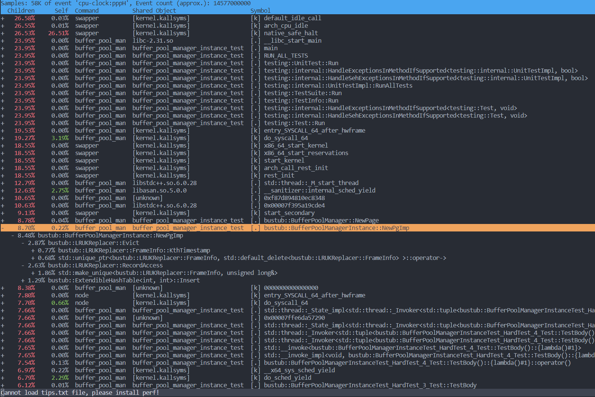

完成 15-445 Project 1 后，将代码提交到 GradeScope，运行时长为 8s 左右。而 Leaderboard 中排名第一的大佬耗时仅为 1s，于是尝试优化 Project 1 的代码来刷刷 Leaderboard 排名，至少差距不要太大...

之前没有 C++ 性能优化的经验，一通搜索找到了 [perf](https://perf.wiki.kernel.org/index.php/Main_Page)。perf 是 linux 下的一款性能调优工具。

## Installation

安装方式 (Ubuntu 20.04 LTS)：
```bash
sudo apt-get install linux-tools-$(uname -r) linux-tools-generic -y
```

## Commands

```bash
sudo perf record -g -a /path/to/your/application
```
运行一个程序，并对其采样，生成相关数据 `perf.data`。`-g` 表明记录函数调用关系，`-a` 为路径名，还有一个可选参数 `-e`，表明需要监控的事件。

perf 有一个监控事件列表，包含 cpu clock，cache miss，page fault 等各种事件。可以用
```bash
sudo perf list
```
查看。默认为 cpu clock。

生成 `perf.data` 后，执行
```bash
sudo perf report -g
```
查看报告。

在报告中可以看到各个函数的使用情况以及调用关系。



再查找热点函数，看看耗时较高的原因是什么，进行相关的优化就可以了。

perf 还有生成火焰图等更高阶的功能，以后也可以尝试一下。

## Optimization

我主要对之前的代码进行了两个地方的优化。

一是 LRU-K Replacer 中，我原本用一个 `std::unordered_map` 存储 frames 的信息，在报告中发现性能并不好，因为有频繁的哈希表插入删除操作。之后改为了直接用 `std::vector` 存放。删除时，将相应的 frame 置为空指针。 

第二个也是 LRU-K Replacer 中的问题。在 LRU-K 算法中，如果存在引用次数小于 K 的 frame，则要在这些 frame 中使用普通的 LRU 算法，即找到第一次引用时间最小的 frame。在查找 frame 的第一次引用时间时，我直接简单地遍历引用记录。由于使用 `std::list` 存放引用记录，而链表的遍历是 O(n)，因此这里也出现了一定的性能问题。因此我额外用了一个 `earliest_ref` 变量来保存第一次引用的时间。只要在第一次发生引用时初始化这个变量，之后每次查询第一次引用时直接返回这个变量。

经过优化后，再次使用 perf 生成报告，可以发现相关的函数耗时下降不少。

## Result

再次在 GradeScope 上提交，总耗时成功降到了 3.5s 左右，优化效果还是挺明显的。虽说还有挺大的优化空间，但目前的性能应该也够用了。

还是没有进行针对多线程的性能优化，下次一定。