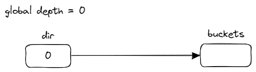
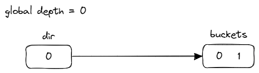
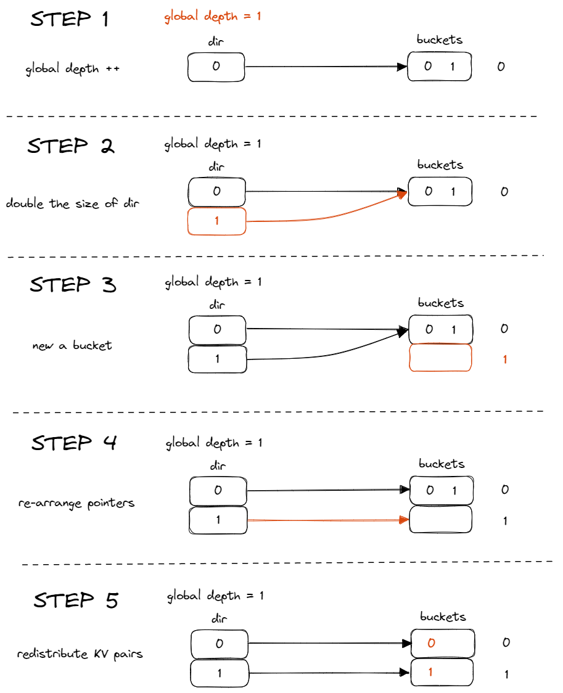
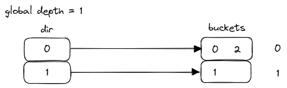
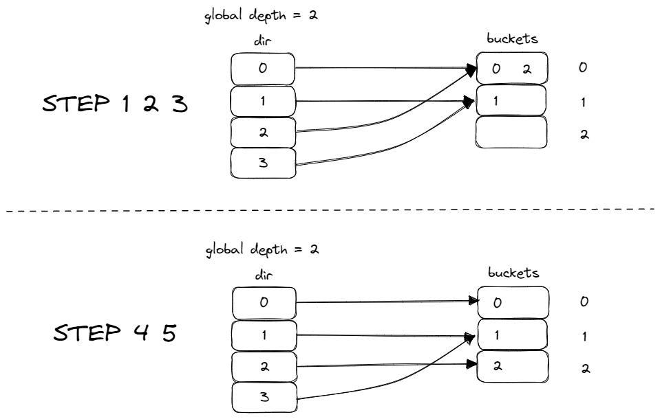
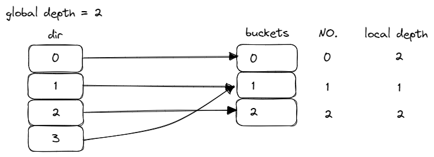
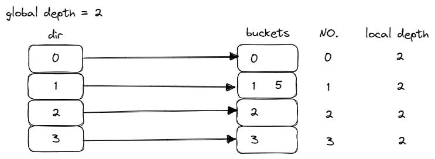
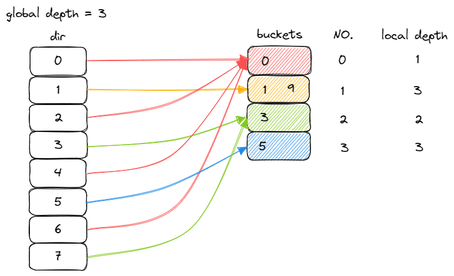

暂时战略放弃了 6.824 的 Lab4，来做做 CMU 新鲜出炉的 [15-445 FALL 2022](https://15445.courses.cs.cmu.edu/fall2022)。

## Resources
- [https://15445.courses.cs.cmu.edu/fall2022](https://15445.courses.cs.cmu.edu/fall2022) 课程官网
- [https://github.com/cmu-db/bustub](https://github.com/cmu-db/bustub) Bustub Github Repo
- [https://www.gradescope.com/](https://www.gradescope.com/) 自动测评网站 GradeScope，course entry code: PXWVR5
- [https://discord.gg/YF7dMCg](https://discord.gg/YF7dMCg) Discord 论坛，课程交流用
- bilibili 有搬运的课程视频，自寻。

**请不要将实现代码公开，尊重 Andy 和 TAs 的劳动成果！**

## Set up Environment
实验需要 Linux 环境。虽说 Docker 什么的似乎也可以，但 Linux 总是更令人安心。为了方便测试，我选择了云服务器。

JetBrains 家推出了新的 SSH 远程开发功能。本来想试试，结果 CLion 在 server 上足足吃了两三个 G 的内存，我 2 核 4G 的服务器不堪重负，还是老老实实用 vscode remote。

Debug 推荐用 lldb，在 vscode 安装相关插件后体验很好。终于不用整天翻看 6.824 又臭又长的 log 了。

## Overview
Project1 主要与 Bustub 的 storage manager 相关，分为三个部分：

- Extendible Hash Table
- LRU-K Replacer
- Buffer Pool Manager Instance

其中 `Extendible Hash Table` 和 `LRU-K Replacer` 是 `Buffer Pool Manager` 内部的组件，而 `Buffer Pool Manager` 则是向系统提供了获取 page 的接口。系统拿着一个 `page_id` 就可以向 `Buffer Pool Manager` 索要对应的 page，而不关心这个 page 具体存放在哪。系统并不关心（也不可见）获取这个 page 的过程，无论是从 disk 还是 memory 上读取，还是 page 可能发生的在 disk 和 memory 间的移动。这些内部的操作交由 `Buffer Pool Manager` 完成。

`Disk Manager` 已经为我们提供，是实际在 disk 上读写数据的接口。

## Extendible Hash Table

### Extendible Hash Table Design

这个部分要实现一个 extendible 哈希表，内部不可以用 built-in 的哈希表，比如 `unordered_map`。

Extendible Hash Table 主要由一个 directory 和多个 bucket 组成。
- **directory**: 存放指向 bucket 的指针，是一个数组。用于寻找 key 对应 value 所在的 bucket。
- **bucket**: 存放 value，是一个链表。一个 bucket 可以至多存放指定数量的 value。

Extendible Hash Table 与 Chained Hash Table 最大的区别是，Extendible Hash 中，不同的指针可以指向同一个 bucket，而 Chained Hash 中每个指针对应一个 bucket。

发生冲突时，Chained Hash 简单地将新的 value 追加到其 key 对应 bucket 链表的最后，也就是说 Chained Hash 的 bucket 没有容量上限。而 Extendible Hash 中，如果 bucket 到达容量上限，则对桶会进行一次 split 操作。

在介绍 split 之前，我们先介绍一下 Extendible Hash 的插入流程。

将一个键值对 (K,V) 插入哈希表时，会先用哈希函数计算 K 的哈希值 H(K)，并用此哈希值计算出索引，将 V 放入索引对应的 bucket 中。

Extendible Hash 计算索引的方式是直接取哈希值 H(K) 的低 n 位。在这里，我们把 n 叫做 global depth。例如，K 对应的 H(K) = 1010 0010b，此时 global depth 为 4，则对应的 index 为 0010，即应将 V 放入 directory 里 index 为 2 的指针指向的 bucket 中。

global depth 的初始值为 0，取 H(K) 的低 0 位为索引，永远为 0，即初始时只有一个 bucket。

我们指定 bucket 的容量为 2，现在向表中插入 KV 对。方便起见，就不具体指明 V 的值了，仅关注 K。K 从 0 递增，并且假设 H(K) = K。

首先插入 0 和 1。由于 global depth 为 0，所以 H(K) 计算出的 index 均为 0：

再插入 2。index 仍然为 0。而此时 bucket 已满，无法继续插入 2，则需要进行之前提到的 split 操作。这时的 split 包含如下几个步骤：

1. global depth++
2. directory 容量翻倍
3. 创建一个新的 bucket
4. 重新安排指针
5. 重新分配 KV 对

流程如下：

到目前为止应该还是比较容易理解的。global depth++ 后为 1，需要取 H(K) 的低 1 位作为 index，index 就有了 0 1 之分。因此 dir 拥有的指针数需要翻倍。仅仅是 index 数量翻倍还不够，此时 0 和 1 仍然指向同一个 bucket，仍然没有空间插入新值，因此还需要新创建一个 bucket。创建 bucket 后，自然需要将 dir 指针重新安排，0 指向 bucket 0，1 指向 bucket 1。

为什么 KV 对也需要重新分配？假设不重新分配 KV 对，现在有一个 find 请求，查找 K=1 对应的 V。H(K)=1，global depth=1，则 index=1。而此时 index=1 对应的 bucket 空空如也。

因此为了保证原数据与新的表结构兼容，需要重新计算发生 split 的 bucket，即 bucket 0 中所有 KV 对的新位置，并重新分配。

现在，我们就有了合适的位置来插入 2：

接下来我们尝试插入 4。global depth 为 1，H(K)= 100b，index=0。而 index=0 指向的 bucket 又满了，再对 bucket 0 进行一次 split：

到这里就体现了 Extendible Hash 特殊之处：多个 index 可以指向同一个 bucket。为了支持这种特性，要引入一个新的变量，local depth。

每个 bucket 都有一个自己的 local depth。bucket 实际上只用到了 H(K) 的低 local depth 位作为索引。local depth 的初始值为 0。在 bucket 发生 split 时，local depth++：

bucket 0 和 bucket 2 的 local depth 均为 2，即他们实际上都用到了 H(K) 的低 2 位作为 index。例如，H(0)=00b，H(2)=10b，则 0 和 2 对应的 index 分别为 0 和 2，实际上也被分配在了 bucket 0 和 2。

bucket 1 的 local depth 为 1，其中存放的值实际上只用到了 H(K) 的低 1 位。例如 H(1)=01b，H(3)=11b，index 分别为 1 和 3，但实际上只用到了低 1 位，均为 1，因此 1 和 3 均被放在 bucket 1 中。

经过第 2 次 split，我们有了放入 4 的空间。H(4)=100b，global depth=2，index=0，即 4 被放入 dir[0] 对应的 bucket 0 中。

插入 3，成功插入到 bucket 1 中。

再插入 5。此时 bucket 1 已满，需要对 bucket 1 进行 split。但我们可以发现，这次插入并不需要将 dir 的容量翻倍，仅需新建一个 bucket 3，将 index 3 对应指针指向 bucket 3，并将原 bucket 1 中的 KV 对重新分配到 bucket 1 和 bucket 3 中：

也就是说，当 bucket 需要分裂时，如果此时已经有多个指针指向 bucket，无需对 dir 进行扩容，仅执行原 5 步中的第 3、4、5 步。在代码中的体现就是，当需要插入 K 时，发现 bucket 已满，首先判断当前 bucket 的 local depth 是否等于 global depth：

- 若相等，即仅有一个指针指向 bucket，需要对 dir 扩容。
- 若不相等，即有多个指针指向 bucket，则无需扩容，将原来指向此 bucket 的指针重新分配。

现在还剩下几个关键的问题：

- dir 扩容时，新的指针应该指向哪里？
  假如 global depth=2，原索引为 000b 001b 010b 011b，则扩容添加的索引为 100b 101b 110b 111b，可以看出低两位的值是一一对应的，因此新加的索引应指向对应索引指向的 bucket。

- 如何重新安排指针？
  我们把指向同一个 bucket 的指针称为兄弟指针。重新安排指针实际上是重新安排指向需要 split 的 bucket 的兄弟指针。需要注意的是，兄弟指针不一定只有两个，而可以有 2^n 次个。例如下面这种情况：
    
    

  当我们插入 0 1 3 5 9 时，就会出现这种情况，其中 bucket 0 共有 2^2 个兄弟指针。实际上，兄弟指针的个数为 2^(global depth - local depth)。那么得知一个 index 后，如何找到这个 index 所有兄弟指针？仍然以上面为例。插入 2，插入至 bucket 0，再插入 4，bucket 0 已满，进行一次 split。H(4) = 100b，对应 index 是 4。因此需要找到 index 4 的所有兄弟指针。bucket 0 的 local depth 为 1，即只用到了低 1 位。100b 的低 1 位为 0。那么其兄弟指针的低 1 位也应是 0，即 000b 010b 100b 110b，分别为 0 2 4 6。这样我们就找到了所有的兄弟指针。接下来将兄弟指针重新分配。local depth 变为 2，用到低 2 位，则兄弟指针可以分为两组，x00b 和 x10b，即 0 4 一组，2 6 一组。其中，一组指向原 bucket 0，另一组指向新 bucket 4。这样就完成了指针的重新分配。
  其他情况也是类似的，先通过低位相同的特征找到所有兄弟指针，再将兄弟指针按照新位是 0 还是 1 分为两组，分别指向原 bucket 和新 bucket。

- 如何重新分配 KV 对？
  仅需用 global depth 重新计算一遍 K 对应的 index 并插入对应 bucket。

到这里 Extendible Hash Table 就介绍完毕了。接下来说几个实现上的小细节。

### Extendible Hash Table Implementation

Extendible Hash Table 是要保证线程安全的。目前我的策略是一把大锁报平安。这样做多线程的性能肯定是很糟的。实际上应该是整个 table 一把大锁，再分区加多把小锁，或者更简单的做法，每个 bucket 一把小锁。均使用读写锁。

对于每个 bucket，在 Find 时上读锁，Insert 和 Remove 时上写锁。

对于整张表，Find 和 Remove 时上读锁。Find 上读锁好理解，而 Remove 实际上只会改变 bucket 的内部变量，其线程安全由 bucket 内部锁保证，因此也可以只上读锁。Insert 在无需 split 时也可以仅上读锁，需要 split 时上写锁。

我按照这个思路尝试优化了一下，结果成功负优化。可能是哪里出了点问题，有空再回头看看。先一把大锁凑合用。

另一个小细节是，每次 Insert 前要判断一下是否需要 split。而 split 之后不一定代表可以直接 Insert，因为可能重新分配 KV 对时，所有的 KV 对又被塞到了同一个 bucket 里，而凑巧的是需要插入的 KV 对也被带到了这个 bucket。因此需要循环判断，可能需要多次 split 才能成功插入。

## LRU-K Replacer

TODO