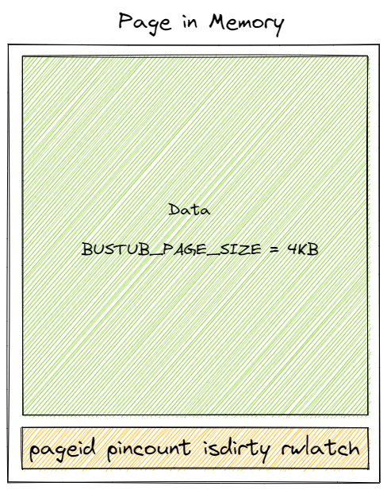
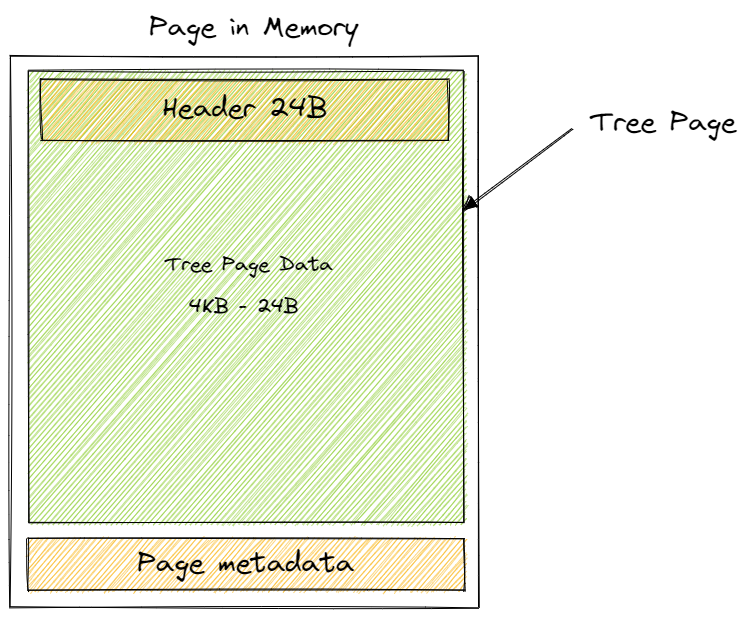
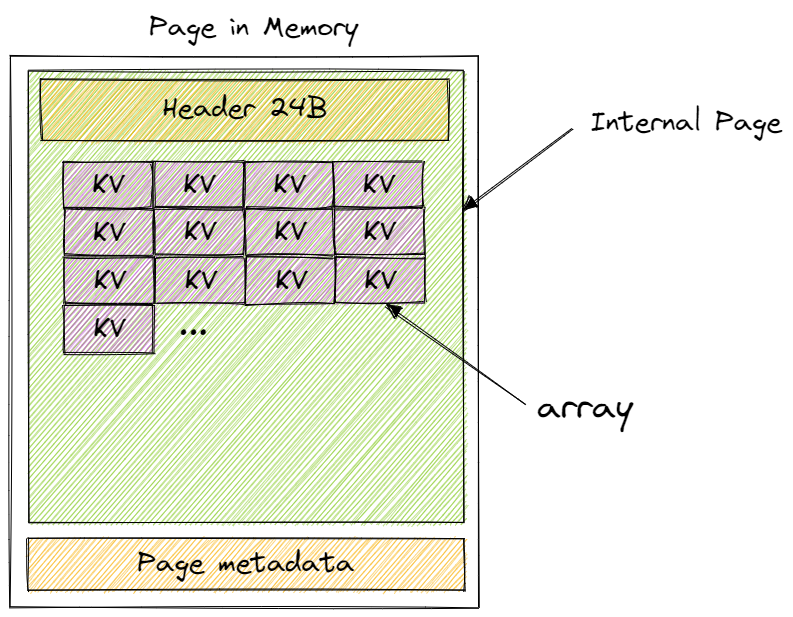
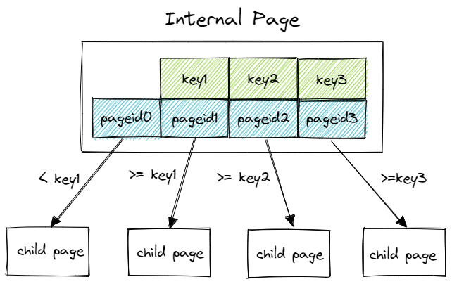
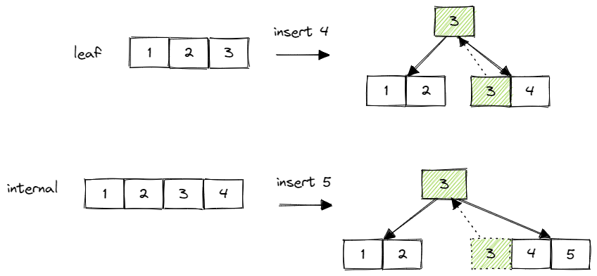
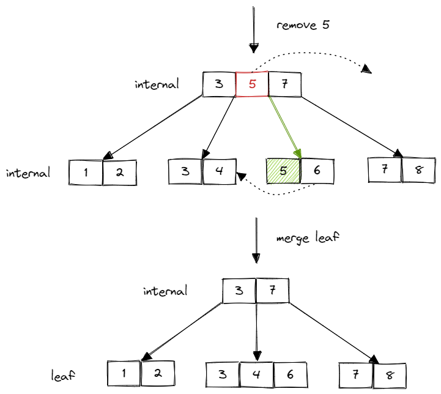
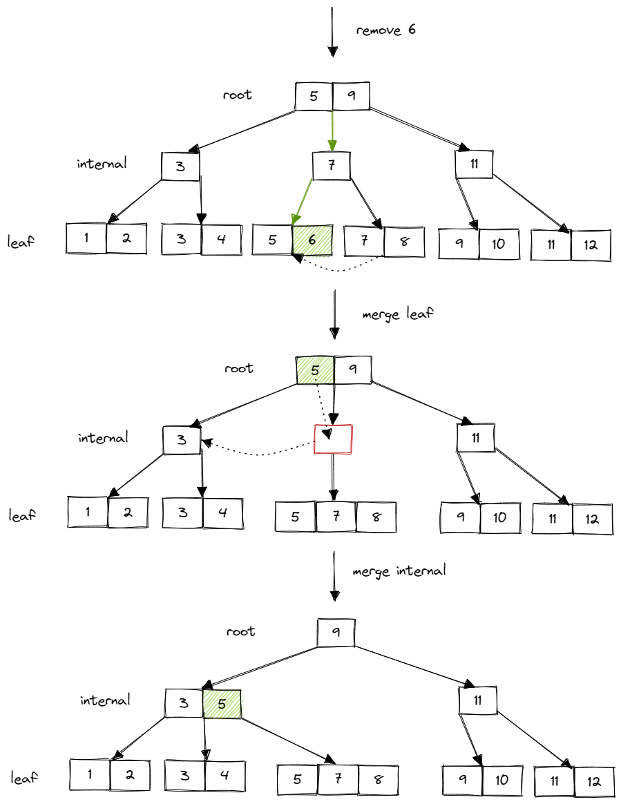

来记录一下 Bustub 噩梦 B+ 树的实现过程。

## Resources

- [https://15445.courses.cs.cmu.edu/fall2022](https://15445.courses.cs.cmu.edu/fall2022) 课程官网
- [https://github.com/cmu-db/bustub](https://github.com/cmu-db/bustub) Bustub Github Repo
- [https://www.gradescope.com/](https://www.gradescope.com/) 自动测评网站 GradeScope，course entry code: PXWVR5
- [https://discord.gg/YF7dMCg](https://discord.gg/YF7dMCg) Discord 论坛，课程交流用
- bilibili 有搬运的课程视频，自寻。
- [https://goneill.co.nz/btree-demo.php](https://goneill.co.nz/btree-demo.php) B+ 树插入删除的动态演示

**请不要将实现代码公开，尊重 Andy 和 TAs 的劳动成果！**

## Overview
Project 2 需要为 Bustub 实现 B+ 树索引。拆分为两个部分：

- Checkpoint1: 单线程 B+ 树
- Checkpoint2: 多线程 B+ 树

实验中给出的 B+ 树接口非常简单，基本只有查询、插入和删除三个接口，内部基本没有给出别的辅助函数，可以让我们自由发挥（无从下手）。因此，任何合法的 B+ 树实现都是允许的。

B+ 树索引在 Bustub 中的位置如图所示：


需要使用我们在 Project 1 中实现的 buffer pool manager 来获取 page。

## Checkpoint1 Single Thread B+Tree

Checkpoint1 分为两个部分：

- Task1: B+Tree pages，B+树中的各种 page。在 Bustub 索引 B+ 树中，所有的节点都是 page。包含 leaf page，internal page ，和它们的父类 tree page。
- Task2：B+Tree Data Structure (Insertion, Deletion, Point Search)。Checkpoint1 的重点，即 B+树的插入、删除和单点查询。

### Task1 B+Tree Pages

Task1 的实现非常简单，都是一些普通的 Getter 和 Setter。这里主要介绍一下 page 的内存布局。

在 Project 1 中我们第一次与 page 打交道。page 实际上可以存储数据库内很多种类的数据。例如索引和实际的表数据等等。

```cpp
/** The actual data that is stored within a page. */
char data_[BUSTUB_PAGE_SIZE]{};
/** The ID of this page. */
page_id_t page_id_ = INVALID_PAGE_ID;
/** The pin count of this page. */
int pin_count_ = 0;
/** True if the page is dirty, i.e. it is different from its corresponding page on disk. */
bool is_dirty_ = false;
/** Page latch. */
ReaderWriterLatch rwlatch_;
```



其中，`data_` 是实际存放 page 数据的地方，大小为 `BUSTUB_PAGE_SIZE`，为 4KB。其他的成员是 page 的 metadata。

B+树中的 tree oage 数据均存放在 page 的 data 成员中。

**B_PLUS_TREE_PAGE**

`b_plus_tree_page` 是另外两个 page 的父类，即 B+树中 tree page 的抽象。

```cpp
IndexPageType page_type_;   // leaf or internal. 4 Byte
lsn_t lsn_  // temporarily unused. 4 Byte
int size_;  // tree page data size(not in byte, in count). 4 Byte
int max_size_;  // tree page data max size(not in byte, in count). 4 Byte
page_id_t parent_page_id_; // 4 Byte
page_id_t page_id_; // 4 Byte
// 24 Byte in total
```  

以上数据组成了 tree page 的 header。



page data 的 4KB 中，24Byte 用于存放 header，剩下的则用于存放 tree page 的数据，即 KV 对。

**B_PLUS_TREE_INTERNAL_PAGE**

对应 B+ 树中的内部节点。

```cpp
MappingType array_[1];
```

internal page 中没有新的 metadata，header 大小仍为 24B。它唯一的成员是这个怪怪的大小为 1 的数组。大小为 1 显然不合理，代表只能存放一个 KV 对。但又没法改变它的大小，难道要用 undefined behavior 来越界访问其后的地址？实际上差不多就是这个意思。但这不是 undefined behavior，是一种特殊的写法，叫做 flexible array。我也不知道怎么翻译。

简单来说就是，当你有一个类，这个类中有一个成员为数组。在用这个类初始化一个对象时，你不能确定该将这个数组的大小设置为多少，但知道这整个对象的大小是多少 byte，你就可以用到 flexible array。flexible array 必须是类中的最后一个成员，并且仅能有一个。在为对象分配内存时，flexible array 会自动填充，占用未被其他变量使用的内存。这样就可以确定自己的长度了。

例如有一个类 C：
```cpp
class C {
    int a; // 4 byte
    int array[1]; // unknown size
};
```
现在初始化一个 C 的对象，并为其分配了 24 byte 的内存。`a` 占了 4 byte 内存，那么 `array` 会尝试填充剩下的内存，大小变为 5。

实际上这就是 C++ 对象内存布局的一个简单的例子。因此 flexible array 为什么只能有一个且必须放在最后一个就很明显了，因为需要向后尝试填充。

此外，虽然成员在内存中的先后顺序和声明的顺序一致，但需要注意可能存在的内存对齐的问题。header 中的数据大小都为 4 byte，没有对齐问题。

到这里，这个大小为 1 的数组的作用就比较清楚了。利用 flexible array 的特性来自动填充 page data 4KB 减掉 header 24byte 后剩余的内存。剩下的这些内存用来存放 KV 对。



internal page 中，KV 对的 K 是能够比较大小的索引，V 是 page id，用来指向下一层的节点。Project 中要求，第一个 Key 为空。主要是因为在 internal page 中，n 个 key 可以将数轴划分为 n+1 个区域，也就对应着 n+1 个 value。实际上你也可以把最后一个 key 当作是空的，只要后续的处理自洽就可以了。



通过比较 key 的大小选中下一层的节点。实际上等号的位置也可以改变，总之，只要是合法的 B+ 树，即节点大小需要满足最大最小值的限制，各种实现细节都是自由的。

另外需要注意的是，internal page 中的 key 并不代表实际上的索引值，仅仅是作为一个向导，引导需要插入/删除/查询的 key 找到这个 key 真正所在的 leaf page。

**B_PLUS_TREE_LEAF_PAGE**
leaf page 和 internal page 的内存布局基本一样，只是 leaf page 多了一个成员变量 `next_page_id`，指向下一个 leaf page（用于 range scan）。因此 leaf page 的 header 大小为 28 Byte。

leaf page 的 KV 对中，K 是实际的索引，V 是 record id。record id 用于识别表中的某一条数据。leaf page 的 KV 对是一一对应的，不像 internal page 的 value 多一个。这里也可以看出来 Bustub 所有的 B+ 树索引，无论是主键索引还是二级索引都是非聚簇索引。

> 这里简单介绍一下聚簇索引、非聚簇索引，主键索引、二级索引（非主键索引）的区别。
> 在聚簇索引里，leaf page 的 value 为表中一条数据的某几个字段或所有字段，一定包含主键字段。而非聚簇索引 leaf page 的 value 是 record id，即指向一条数据的指针。
> 在使用聚簇索引时，主键索引的 leaf page 包含所有字段，二级索引的 leaf page 包含主键和索引字段。当使用主键查询时，查询到 leaf page 即可获得整条数据。当使用二级索引查询时，若查询字段包含在索引内，可以直接得到结果，但如果查询字段不包含在索引内，则需使用得到的主键字段在主键索引中再次查询，以得到所有的字段，进而得到需要查询的字段，这就是回表的过程。
> 在使用非聚簇索引时，无论是使用主键查询还是二级索引查询，最终得到的结果都是 record id，需要使用 record id 去查询真正对应的整条记录。
> 聚簇索引的优点是，整条记录直接存放在 leaf page，无需二次查询，且缓存命中率高，在使用主键查询时性能比较好。缺点则是二级索引可能需要回表，且由于整条数据存放在 leaf page，更新索引的代价很高，页分裂、合并等情况开销比较大。
> 非聚簇索引的优点是，由于 leaf page 仅存放 record id，更新的代价较低，二级索引的性能和主键索引几乎相同。缺点是查询时均需使用 record id 进行二次查询。

Task1 的主要内容就是这些。实际上要实现的内容非常简单，重点是理解各个 page 的作用和内存布局。

### Task2 B+Tree Data Structure (Insertion, Deletion, Point Search)
Task2 是单线程 B+ 树的重点。首先提供演示一个 B+ 树插入删除操作的 [网站](https://goneill.co.nz/btree-demo.php)。主要是看看 B+ 树插入删除的各种细节变化。当然具体实现是自由的，这仅仅是一个示例。

**Search**

先从最简单的 Point Search 开始。B+ 树的结构应该都比较熟悉了，节点分为 internal page 和 leaf page，每个 page 上的 key 有序排列。当拿到一个 key 需要查找对应的 value 时，首先需要经由 internal page 递归地向下查找，最终找到 key 所在的 leaf page。这个过程可以简化为一个函数 `Findleaf()`。

`Findleaf()` 从 root page 开始查找。在查找到 leaf page 时直接返回，否则根据 key 在当前 internal page 中找到对应的 child page id，递归调用 `Findleaf`。根据 key 查找对应 child id 时，由于 key 是有序的，可以直接进行二分搜索。15-445 Lecture 中也介绍了一些其他的方法，比如用 SIMD 并行比较，插值法等等。在这里二分搜索就可以了。

internal page 中储存 key 和 child page id，那么在拿到 page id 后如何获得对应的 page 指针？用 Project 1 中实现的 buffer pool。

```cpp
Page *page = buffer_pool_manager_->FetchPage(page_id);
```

同样地，假如我们需要新建一个 page，也是调用 buffer pool 的 `NewPage()`。

在获取到一个 page 后，如何使用这个 page 来存储数据？之前已经提到过，page 的 `data_` 字段是实际用于存储数据的 4KB 大小的字节数组。通过 `reinterpret_cast` 将这个字节数组强制转换为我们要使用的类型，例如 leaf page：
```cpp
auto leaf_page = reinterpret_cast<B_PLUS_TREE_LEAF_PAGE_TYPE *>(page->GetData())
```
`reinterpret_cast` 用于无关类型的强制转换，转换方法很简单，原始 bits 不变，只是对这些 bits 用新类型进行了重新的解读。可想而知这种转换非常不安全，需要确保转换后的内存布局仍是合法的。在这里原类型是 byte 数组，新类型是我们需要使用的 tree page。

找到 leaf page 后，同样是二分查找 key，找到对应的 record id。

查找的过程比较简单。但还有一个比较重要且复杂的细节，就是 page unpin 的问题。

我们在拿到 page id 后，调用 buffer pool 的 `FetchPage()` 函数来获取对应的 page 指针。要注意的是，在使用完 page 之后，需要将 page unpin 掉，否则最终会导致 buffer pool 中的所有 page 都被 pin 住，无法从 disk 读取其他的 page。

比较合适的做法是，找出 page 最后一次被使用的地方，并在最后一次使用后 unpin。

**Insert**
与 Search 相同，第一步是根据 key 找到需要插入的 leaf page。同样是调用 `Findleaf()`。得到 leaf page 后，将 key 插入 leaf page。要注意的是，插入时仍需保证 key 的有序性。同样可以二分搜索找到合适的位置插入。

在插入后，需要检查当前 leaf page size 是否等于 max size。若相等，则要进行一次 leaf page 分裂操作。具体步骤为：

1. 新建一个空的 page，
2. 将原 page 的一半转移到新 page 中，（假如选择将新 page 放在原 page 右侧，则转移原 page 的右半部分）
3. 更新原 page 和新 page 的 next page id，
4. 获取 parent page，
5. 将用于区分原 page 和新 page 的 key 插入 parent page 中，
6. 更新 parent page 所有 child page 的父节点指针。

这些步骤都比较好理解。需要给 parent page 插入一个新 key 的原因是，多了一个子节点，自然需要多一个 key 来区分。其中第 4 步是重点。获取 parent page 并不是简单地通过当前 page 的 parent id 来获取，因为 parent page 也可能发生分裂。

假如我们有一棵 5 阶的 B+ 树。5 阶只是一种常用的说法，代表 B+ 树节点最多能容纳五个 KV 对。对于 leaf page 来说，当 B+ 树处于稳定状态时（插入、删除等操作已经完全结束），最多只能有 4 个 KV 对。对于 internal page，最多有 4 个 key，5 个 value，可以看成是有 5 个 KV 对。

因此，instruction 中有这么一句话：
> You should correctly perform splits if insertion triggers the splitting condition (number of key/value pairs **AFTER** insertion equals to max_size for leaf nodes, number of children **BEFORE** insertion equals to max_size for internal nodes.).

在插入后检测 leaf page 是否需要分裂，因为 leaf page 稳定时只有 4 个 KV 对，插入后有 5 个，仍能容纳。在插入前检测 internal page，因为 internal page 稳定时就有 5 个 KV 对，若插入后再检测，插入的第 6 个 KV 对会造成越界。

实际上这也只是一种约定，并不是强制的规则。

在第 5 步我们可以拿到 parent page 安全地插入 KV 对，是因为在第 4 步中，我们需要返回一个安全的 parent page。

第 4 步具体操作如下：
1. 根据 parent page id 拿到 parent page，
2. 判断 parent page size 是否等于 max size，（插入前检查）
3. 若小于，直接返回 parent page，
4. 否则，分裂当前 internal page。并根据此后需要插入的 key 选择分裂后的两个 page 之一作为 parent page 返回。

分裂 internal page 的步骤为：
1. 新建一个空的 page，
2. 将原 page 的一半转移到新 page 中，需要注意原 page 和新 page 的第一个 key 都是无效的，
3. 更新新 page 所有 child page 的父节点指针，指向新 page，
4. 获取 parent page，
5. 将用于区分原 page 和新 page 的 key 插入 parent page 中，
6. 更新 parent page 所有 child page 的父节点指针。

可以发现，第 4 步同样是需要重复上述步骤。这里就发生了向上的递归，直到遇到安全的父节点或者遇到根节点。在遇到根节点时，若根节点也需要分裂，则除了需要新建一个节点用来容纳原根节点一半的 KV 对，还需要新建一个新的根节点。

另外需要注意一个细节，在 leaf page 分裂时，向父节点插入 key 时是复制后插入，而 internal page 分裂时，向父节点插入 key 是删除后插入，有点像把 key 上推。

假如有一棵 4 阶的 B+ 树：



这些细节都可以在 B+ 树示例网站上先尝试一遍，再来实现会简单很多。

Insert 的整个流程大致就是先向下递归找到 leaf page，插入 KV 后再向上递归分裂。

**Remove**

同样地，先找到 leaf page。删除 leaf page 中 key 对应的 KV 对后，检查 size 是否小于 min size。如果小于的话，首先尝试从两侧的兄弟节点中偷一个 KV 对。注意只能从兄弟节点，即父节点相同的节点中选取。假如存在一侧节点有富余的 KV 对，则成功偷取，结束操作。若两侧都没有富余的 KV 对，则选择一侧节点与其合并。

偷取的过程比较简单，从左侧节点偷取时，把左侧节点最后一个 KV 对转移至当前节点第一个 KV 对，从右侧节点偷取时，把右侧节点的 KV 对转移至当前节点最后一个 KV 对。leaf page 和 internal page 的偷取过程基本相同，仅需注意 internal page 偷取后更新子节点的父节点指针。

稍难的是合并的过程。同样，任选左右侧一兄弟节点进行合并。将一个节点的所有 KV 对转移至另一节点。若合并的是 leaf page，记得更新 next page id。若合并的是 internal page，记得更新合并后 page 的子节点的父节点指针。然后，删除 parent 节点中对应的 key。删除后，再次检查 size 是否小于 min size，形成向上递归。

当合并 leaf page 后，删除父节点中对应的 key 比较简单，直接删除即可。例如 4 阶 B+ 树：



合并 internal page 后，并不是简单地删除父节点中对应 key，而是有一个父节点 key 下推的过程：



需要注意的是，root page 并不受 min size 的限制。但如果 root page 被删到 size 只剩 1，即只有一个 child page 的时候，应将此 child page 设置为新的 root page。

另外，在合并时，两个 page 合并成一个 page，另一个 page 应该删除，释放资源。删除 page 时，仍是调用 buffer pool 的 `DeletePage()` 函数。

和 Insert 类似，Remove 过程也是先向下递归查询 leaf page，不满足 min size 后先尝试偷取，无法偷取则合并，并向上递归地检查是否满足 min size。

至此，Checkpoint1 的内容已经全部完成。其实有很多细节我都没有提到，比如二分搜索的边界问题，如何查询左右兄弟节点，如何在兄弟节点间移动 KV 对等等。这些都属于比较细枝末节的问题，比较耗时，但认真思考应该都能够解决，更重要的是，这些实现都是自由的。