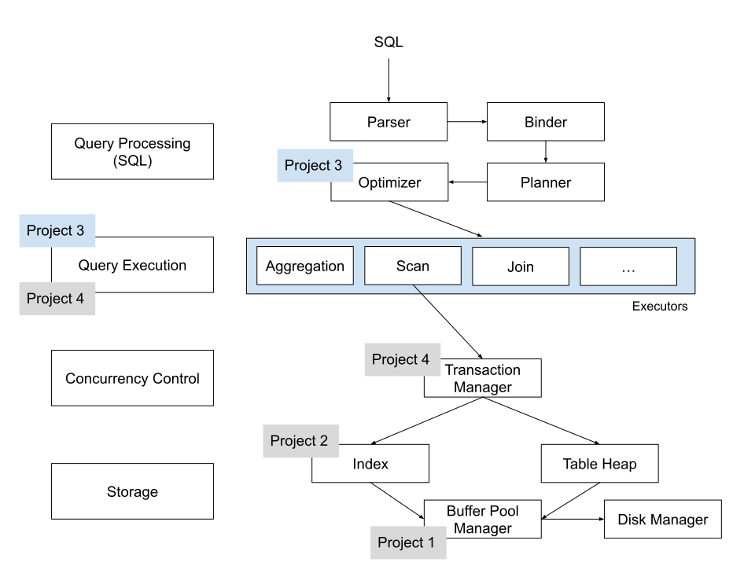
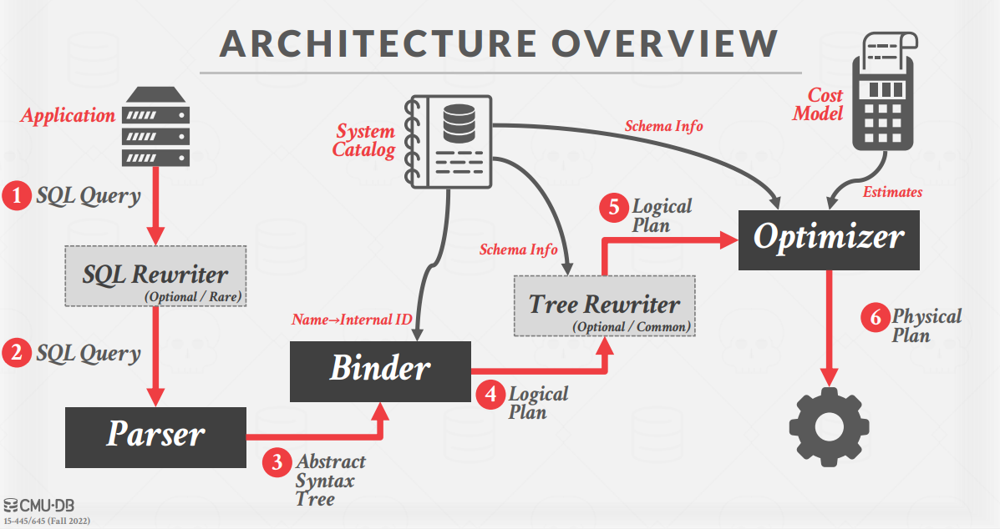
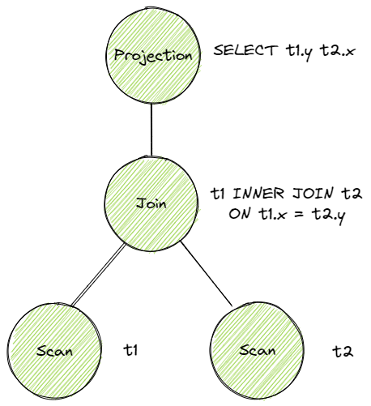
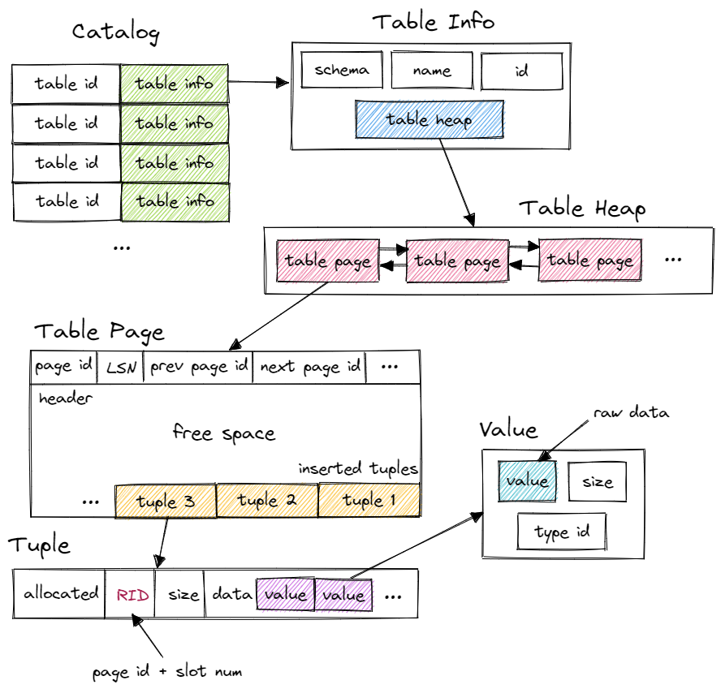
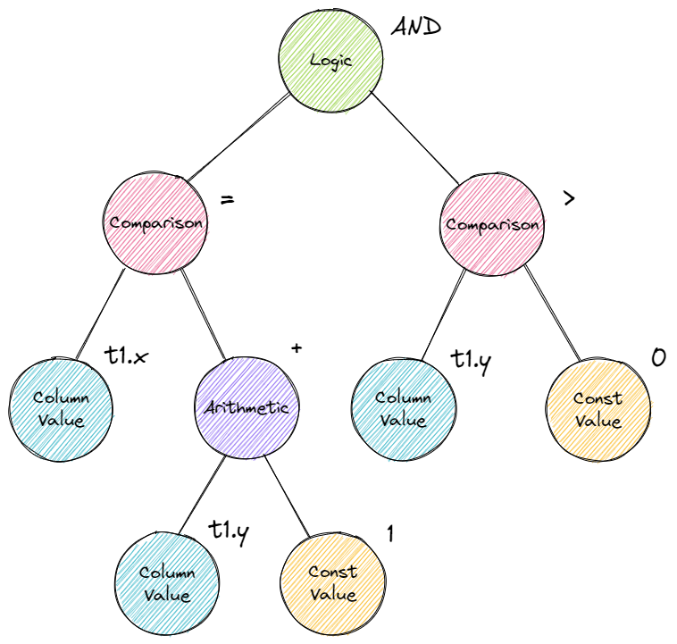

来记录一下 Bustub Query Execution 的实现过程。

在阅读本文前，墙裂推荐阅读 Project 3 开发者迟先生的这篇文章：
[BusTub 养成记：从课程项目到 SQL 数据库](https://zhuanlan.zhihu.com/p/570917775)
可以更清晰地了解到 Bustub SQL 层的设计过程。

## Resources

- [https://15445.courses.cs.cmu.edu/fall2022](https://15445.courses.cs.cmu.edu/fall2022) 课程官网
- [https://github.com/cmu-db/bustub](https://github.com/cmu-db/bustub) Bustub Github Repo
- [https://www.gradescope.com/](https://www.gradescope.com/) 自动测评网站 GradeScope，course entry code: PXWVR5
- [https://discord.gg/YF7dMCg](https://discord.gg/YF7dMCg) Discord 论坛，课程交流用
- bilibili 有搬运的课程视频，自寻。
- [https://15445.courses.cs.cmu.edu/fall2022/bustub/](https://15445.courses.cs.cmu.edu/fall2022/bustub/) 在你的浏览器上运行 Bustub！

**请不要将实现代码公开，尊重 Andy 和 TAs 的劳动成果！**

## Overview

Andy 在 Lecture 中说，Query Optimization 是数据库最难的部分，Transaction 是第二难的部分。总体来说，Project 3 的难度不算大，但和 Project 2 的难点恰好相反：Project 2 的难点在于从零实现 B+ 树，一切都得靠自己。Project 3 的难点在于读代码，理解查询引擎的原理，具体实现起来其实比较简单。



这是课程官网的一张图，清晰地介绍了 Bustub 的整体架构。在 Project 3 中，我们需要实现一系列 Executors，以及为 Optimizer 添加新功能。

- Task1：Access Method Executors. 包含 SeqScan、Insert、Delete、IndexScan 四个算子。
- Task2：Aggregation and Join Executors. 包含 Aggregation、NestedLoopJoin、NestedIndexJoin 三个算子。
- Task3：Sort + Limit Executors and Top-N Optimization. 包含 Sort、Limit、TopN 三个算子，以及实现将 Sort + Limit 优化为 TopN 算子。
- Leaderboard Task：为 Optimizer 实现新的优化规则，包括 Hash Join、Join Reordering、Filter Push Down、Column Pruning 等等，让三条诡异的 sql 语句执行地越快越好。
## Talking Casually

在正式开始记录 Project 3 的具体实现之前，我想随便聊聊 Bustub 整体的结构与运行流程。在迷迷糊糊地通过 Project 3 的所有 tests 后，我意识到这其实是了解数据库到底是如何执行 sql 语句的最佳时机。Project 1&2 都比较局部，而在这里，一个能真正执行 sql 语句的数据库已经构建起来了。先暂时抛开 transaction，来看看一条 sql 语句在 Bustub 中的旅行。



### Parser

一条 sql 语句，首先经过  Parser 生成一棵抽象语法树 AST。具体如何生成，请参考编译原理。Parser 不是数据库的核心部分，也不是性能瓶颈，因此除非热爱编译原理，或者想通过实现一个 sql Parser 对编译原理进行实践，否则一般都会采用第三方库。Bustub 中采用了 libpg_query 库将 sql 语句 parse 为 AST。

### Binder

在得到 AST 后，还需要将这些词语绑定到数据库实体上，这就是 Binder 的工作。例如有这样一条 sql：

```sql
SELECT colA FROM table1;
```

其中 `SELECT` 和 `FROM` 是关键字，`colA` 和 `table1` 是标识符。Binder 遍历 AST，将这些词语绑定到相应的实体上。实体是 Bustub 可以理解的各种 c++ 类。绑定完成后，得到的结果是一棵 Bustub 可以直接理解的树。把它叫做 Bustub AST。

### Planner

得到 Bustub AST 后，Planner 遍历这棵树，生成初步的查询计划。查询计划也是一棵树的形式。例如这条 sql：

```sql
SELECT t1.y, t2.x FROM t1 INNER JOIN t2 ON t1.x = t2.y;
```

对应的原始的查询计划是



查询计划规定了数据的流向。数据从树叶流向树根，自底向上地流动，在根节点输出结果。

### Optimizer

由 Planner 得到初步的查询计划后，再将查询计划交给 Optimizer 进行修改优化，生成优化过后的最终查询计划。Optimizer 主要有两种实现方式：

1. Rule-based. Optimizer 遍历初步查询计划，根据已经定义好的一系列规则，对 PlanNode 进行一系列的修改、聚合等操作。例如我们在 Task 3 中将要实现的，将 Limit + Sort 合并为 TopN。这种 Optimizer 不需要知道数据的具体内容，仅是根据预先定义好的规则修改 Plan Node。
2. Cost-based. 这种 Optimizer 首先需要读取数据，利用统计学模型来预测不同形式但结果等价的查询计划的 cost。最终选出 cost 最小的查询计划作为最终的查询计划。

Bustub 的 Optimizer 采用第一种实现方式。MIT6.830 的 SimpleDB 则是采用第二种方式，有兴趣也可以看看。

另外值得一提的是，一般来说，Planner 生成的是 Logical Plan Node，代表抽象的 Plan。Optimizer 则生成 Physical Plan Node，代表具体执行的 Plan。一个比较典型的例子是 Join。在 Planner 生成的查询计划中，Join 就是 Join。在 Optimizer 生成的查询计划中，Join 会被优化成具体的 HashJoin 或 NestedIndexJoin 等等。在 Bustub 中，并不区分 Logical Plan Node 和 Physical Plan Node。Planner 会直接生成 Physical Plan Node。

### Executor

在拿到 Optimizer 生成的具体的查询计划后，就可以生成真正执行查询计划的一系列算子了。算子也是我们在 Project 3 中需要实现的主要内容。生成算子的步骤很简单，遍历查询计划树，将树上的 PlanNode 替换成对应的 Executor。算子的执行模型也大致分为三种：

1. Iterator Model，或 Pipeline Model，或火山模型。每个算子都有 `Init()` 和 `Next()` 两个方法。`Init()` 对算子进行初始化工作。`Next()` 则是向下层算子请求下一条数据。当 `Next()` 返回 false 时，则代表下层算子已经没有剩余数据，迭代结束。可以看到，火山模型一次调用请求一条数据，占用内存较小，但函数调用开销大，特别是虚函数调用造成 cache miss 等问题。
2. Materialization Model. 所有算子立即计算出所有结果并返回。和 Iterator Model 相反。这种模型的弊端显而易见，当数据量较大时，内存占用很高。但减少了函数调用的开销。比较适合查询数据量较小的 OLTP workloads。
3. Vectorization Model. 对上面两种模型的中和，一次调用返回一批数据。利于 SIMD 加速。目前比较先进的 OLAP 数据库都采用这种模型。

Bustub 采用的是 Iterator Model。

此外，算子的执行方向也有两种：

1. Top-to-Bottom. 从根节点算子开始，不断地 pull 下层算子的数据。
2. Bottom-to-Top. 从叶子节点算子开始，向上层算子 push 自己的数据。

Bustub 采用 Top-to-Bottom。

在根节点算子处，就得到了我们想要查询的数据，一条 sql 语句完成了它的使命。

另外，我们在 Project 1 中实现的 Buffer Pool 和在 Project 2 中实现的 B+Tree Index 在哪里？实际上就在一系列算子下。例如 SeqScan 算子，需要遍历 table，首先通过数据库的 catalog 找到对应的 table，一个 table 由许多 page 组成，在访问 page 时，就用到了 Buffer Pool。在 Optimizer 中，假如发现 Sort 算子在对 indexed attribute 排序，会将 Sort 算子优化为 IndexScan 算子，这样就用到了 B+Tree Index。

Bustub Query Execution 的大致结构就是这样，还有很多设计上的细节没有提到，比如 Tuple、Value、AbstractExpression 等等。接下来在具体实现中边看边聊。

## Task 1 Access Method Executors

Task 1 包含 4 个算子，SeqScan、Insert、Delete 和 IndexScan。

### SeqScan

读取给定 table 中的所有 tuple，仅会出现在查询计划的叶子节点处。直接使用已经提供的 `TableIterator`。实现起来挺简单的。此外主要想聊聊 Bustub 中 table 的结构。



首先，Bustub 有一个 Catalog。Catalog 提供了一系列 API，例如 `CreateTable()`、`GetTable()` 等等。Catalog 维护了几张 hashmap，保存了 table id 和 table name 到 table info 的映射关系。table id 由 Catalog 在新建 table 时自动分配，table name 则由用户指定。

这里的 table info 包含了一张 table 的 metadata，有 schema、name、id 和指向 table heap 的指针。系统的其他部分想要访问一张 table 时，先使用 name 或 id 从 Catalog 得到 table info，再访问 table info 中的 table heap。

table heap 是管理 table 数据的结构，包含 `InsertTuple()`、`MarkDelete()` 一系列 table 相关操作。table heap 本身并不直接存储 tuple 数据，tuple 数据都存放在 table page 中。table heap 可能由多个 table page 组成，仅保存其第一个 table page 的 page id。需要访问某个 table page 时，通过 page id 经由 buffer pool 访问。

table page 是实际存储 table 数据的结构，父类是 page。相较于 page，table page 多了一些新的方法。table page 在 data 的开头存放了 next page id、prev page id 等信息，将多个 table page 连成一个双向链表，便于整张 table 的遍历操作。当需要新增 tuple 时，table heap 会找到当前属于自己的最后一张 table page，尝试插入，若最后一张 table page 已满，则新建一张 table page 插入 tuple。table page 低地址存放 header，tuple 从高地址也就是 table page 尾部开始插入。

tuple 对应数据表中的一行数据。每个 tuple 都由 RID 唯一标识。RID 由 page id + slot num 构成。tuple 由 value 组成，value 的个数和类型由 table info 中的 schema 指定。

value 则是某个字段具体的值，value 本身还保存了类型信息。

需要注意的是，executor 本身并不保存查询计划的信息，应该通过 executor 的成员 plan 来得知该如何进行本次计算，例如 SeqScanExecutor 需要向 SeqScanPlanNode 询问自己该扫描哪张表。

所有要用到的系统资源，例如 Catalog，Buffer Pool 等，都由 `ExecutorContext` 提供。

### Insert & Delete

Insert 和 Delete 这两个算子实现起来基本一样，也比较特殊，是唯二的写算子。数据库最主要的操作就是增查删改。Bustub sql 层暂时不支持 UPDATE。Insert 和 Delete 一定是查询计划的根节点，且仅需返回一个代表修改行数的 tuple。

Insert 和 Delete 时，记得要更新与 table 相关的所有 index。index 与 table 类似，同样由 Catalog 管理。需要注意的是，由于可以对不同的字段建立 index，一个 table 可能对应多个 index，所有的 index 都需要更新。

Insert 时，直接将 tuple 追加至 table 尾部。Delete 时，并不是直接删除，而是将 tuple 标记为删除状态，也就是逻辑删除。（在事务提交后，再进行物理删除，Project 3 中无需实现）

Insert & Delete 的 `Next()` 只会返回一个包含一个 integer value 的 tuple，表示 table 中有多少行受到了影响。

### IndexScan

使用我们在 Project 2 中实现的 B+Tree Index Iterator，遍历 B+ 树叶子节点。由于我们实现的是非聚簇索引，在叶子节点只能获取到 RID，需要拿着 RID 去 table 查询对应的 tuple。

在完成 Task 1 的四个算子后，可以用已提供的 sqllogictest 工具和已提供的一些 sql 来检验自己的算子是否实现正确。

关于 Task 1 的具体实现的确没太多可说的，基本是把官网的 instruction 翻译了一遍。后面几个 task 难度会稍大一点点，也会讲讲更具体的实现。

## Task 2 Aggregation & Join Executors

Task 2 包含了 3 个算子，Aggregation、NestedLoopJoin 和 NestedIndexJoin。

### Aggregation

Aggregation 算子就稍微复杂一点了。先看看 `AggregationExecutor` 的成员：

```cpp
/** The aggregation plan node */
const AggregationPlanNode *plan_;
/** The child executor that produces tuples over which the aggregation is computed */
std::unique_ptr<AbstractExecutor> child_;
/** Simple aggregation hash table */
SimpleAggregationHashTable aht_;
/** Simple aggregation hash table iterator */
SimpleAggregationHashTable::Iterator aht_iterator_;
```

主要说说这个 `SimpleAggregationHashTable`。Aggregation 是 pipeline breaker。也就是说，Aggregation 算子会打破 iteration model 的规则。原因是，在 Aggregation 的 `Init()` 函数中，我们就要将所有结果全部计算出来。原因很简单，比如下面这条 sql：

```sql
SELECT t.x, max(t.y) FROM t GROUP BY t.x;
```

结果的每条 tuple 都是一个 `t.x` 的聚合，而要得到同一个 `t.x` 对应的 `max(t.y)`，必须要遍历整张表。因此，Aggregation 需要在 `Init()` 中直接计算出全部结果，将结果暂存，再在 `Next()` 中一条一条地 emit。而 `SimpleAggregationHashTable` 就是计算并保存 Aggregation 结果的数据结构。

`SimpleAggregationHashTable` 维护一张 hashmap，键为 `AggregateKey`，值为 `AggregateValue`，均为 `std::vector<Value>`。key 代表 group by 的字段的数组，value 则是需要 aggregate 的字段的数组。在下层算子传来一个 tuple 时，将 tuple 的 group by 字段和 aggregate 字段分别提取出来，调用 `InsertCombine()` 将 group by 和 aggregate 的映射关系存入 `SimpleAggregationHashTable`。若当前 hashmap 中没有 group by 的记录，则创建初值；若已有记录，则按 aggregate 规则逐一更新所有的 aggregate 字段，例如取 max/min，求 sum 等等。例如下面这条 sql：

```sql
SELECT min(t.z), max(t.z), sum(t.z) FROM t GROUP BY t.x, t.y;
```

group by（AggregateKey）为 `{t.x, t.y}`，aggregate（AggregateValue）为 `{t.z, t.z, t.z}`。aggregate 规则为 `{min, max, sum}`。

需要额外注意的是 `count(column)` 和 `count(*)` 的区别，以及对空值的处理。另外，不需要考虑 hashmap 过大的情况，即整张 hashmap 可以驻留在内存中，不需要通过 Buffer Pool 调用 page 来存储。

在 `Init()` 中计算出整张 hashmap 后，在 `Next()` 中直接利用 hashmap iterator 将结果依次取出。Aggregation 输出的 schema 形式为 group-bys + aggregates。

### NestedLoopJoin

Project 3 中只要求实现 NestedLoopJoin，HashJoin 不做强制要求，而是放在了 Leaderboard Optional 里。实际上实现一个 in-memory 的 HashJoin 也不难。Join 应该是经典的数据库性能瓶颈。Andy 在 Lecture 里也详细地量化地对比了各种 Join 的 costs，有兴趣可以看看。

NestedLoopJoin 算法本身并不难，但比较容易掉进坑里。伪代码大概是这样：
```cpp
for outer_tuple in outer_table:
    for inner_tuple in inner_table:
        if inner_tuple matched outer_tuple:
            emit
```

有了这个例子，很容易把代码写成：

```cpp
while (left_child->Next(&left_tuple)){
    while (right_child->Next(&right_tuple)){
        if (left_tuple matches right_tuple){
            *tuple = ...;   // assemble left & right together
            return true;
        }
    }        
}
return false;
```

一开始看起来似乎没什么问题。然而很快可以发现有一个严重的错误，right child 在 left child 的第一次循环中就被消耗完了，之后只会返回 false。解决方法很简单，在 `Init()` 里先把 right child 里的所有 tuple 取出来暂存在一个数组里就好，之后直接访问这个数组。

```cpp
while (left_child->Next(&left_tuple)){
    for (auto right_tuple : right_tuples){
        if (left_tuple matches right_tuple){
            *tuple = ...;   // assemble left & right together
            return true;
        }
    }        
}
return false;
```

看起来好像又没什么问题。然而，同一列是可能存在 duplicate value 的。在上层算子每次调用 NestedLoopJoin 的 `Next()` 时，NestedLoopJoin 都会向下层算子请求新的 left tuple。但有可能上一个 left tuple 还没有和 right child 中所有能匹配的 tuple 匹配完（只匹配了第一个）。

例如这两张表：

```
   t1          t2   
---------   ---------
|   x   |   |   x   |
---------   ---------
|   1   |   |   1   |
|   2   |   |   1   |
|   3   |   |   2   |
---------   ---------
```

现在执行

```sql
SELECT * FROM t1 INNER JOIN t2 ON t1.x = t2.x;
```

t1 中的 1 只会和 t2 的第一个 1 匹配，产生一行输出。再下一次调用 `Next()` 时，左边会直接选取 2 开始尝试匹配。

解决方法也很简单，在算子里暂存 left tuple，每次调用 `Next()` 时，先用暂存的 left tuple 尝试匹配。并且要记录上一次右表匹配到的位置，不要每次都直接从右表第一行开始匹配了。右表遍历完还没有匹配结果，再去找左表要下一个 tuple。

说来说去，实际上就是注意迭代器要保存上下文信息。

INNER JOIN 和 LEFT JOIN 按规则实现就好，差不多。LEFT JOIN 注意处理空值。

还有一个小问题，怎么判断两个 tuple 是否匹配？这里就要第一次遇到 Project 3 里另一个重要的类 `AbstractExpression` 了。

`AbstractExpression` 抽象了 sql 中的各种表达式，包括 `ArithmeticExpression`、`ColumnValueExpression`、`ComparisonExpression`、`ConstantValueExpression` 和 `LogicExpression`。这都是什么？看下面这条 sql：

```sql
SELECT * FROM t1 WHERE t1.x = t1.y + 1 AND t1.y > 0;
```

重点关注 `WHERE` 后的表达式 `t1.x = t1.y + 1 AND t1.y > 0`。看这下面这张图：



其实就是一颗表达式树。`AbstractExpression` 就是表达式树的节点。sql 中的所有表达式都会被 parse 为表达式树，在 Binder 中进行绑定。上面的 JOIN 中也存在表达式 `t1.x = t2.x`。`AbstractExpression` 里最重要的方法就是 `Evaluate()`，返回值是 value。调用 `Evaluate()`，参数为 tuple 和 tuple 对应的 schema，返回从这个 tuple 中提取数据后代入表达式计算得到的结果。

在 NestedLoopJoin 里，我们要用到的是 `EvaluateJoin()`，也差不多，只不过输入的是左右两个 tuple 和 schema。返回值是表示 true 或 false 的 value。true 则代表成功匹配。

到这里，NestedLoopJoin 就成功实现了。Join 输出的 schema 为 left schema + right schema。

后来我看了一下 [RisingLight](https://github.com/risinglightdb/risinglight/blob/main/src/executor_v2/nested_loop_join.rs) 里的实现，我这个 rustacean 萌新的第一反应是惊为天人。大致是这样：

```rust
pub async fn Execute(){
    for left_tuple in left_table {
        for right_tuple in right_table {
            if matches {
                yield AssembleOutput();
            }
        }
    }
}
```

这是一个生成器，当执行到 yield 时，函数会暂时中断，从生成器回到调用者。而调用者再次进入生成器时，可以直接回到上次中断的地方。再配合 stream，就利用 rust 的无栈协程和异步编程完美地实现了一个 NestedLoopJoin 算子，比手动保存上下文信息优雅太多了。

后来仔细想想，Go 也可以有类似的写法：
```go
func Executor(out_ch, left_ch, right_ch chan Tuple) {
    for left_tuple := range left_ch {
        for right_tuple := range right_ch {
            if matches {
                out_ch <- AssembleOutput();
            }
        }
    }
    close(out_ch)
}
```

每个算子都是一个 goroutine，通过 channel 实现异步的计算，好像也不错。

### NestedIndexJoin

在进行 equi-join 时，如果发现 JOIN ON 右边的字段上建了 index，则 Optimizer 会将 NestedLoopJoin 优化为 NestedIndexJoin。具体实现和 NestedLoopJoin 差不多，只是在尝试匹配右表 tuple 时，会拿 join key 去 B+Tree Index 里进行查询。如果查询到结果，就拿着查到的 RID 去右表获取 tuple 然后装配成结果输出。其他的就不再多说了。

## Task 3 Sort + Limit Executors and Top-N Optimization

Task 3 中要实现 3 个算子，Sort、Limit 和 TopN，以及将 Limit + Sort 在 Optimizer 中优化为 TopN。

### Sort

Sort 也是 pipeline breaker。在 `Init()` 中读取所有下层算子的 tuple，并按 ORDER BY 的字段升序或降序排序。Sort 算子说起来比较简单，实现也比较简单，主要需要自定义 `std::sort()`。

`std::sort()` 的第三个参数可以传入自定义的比较函数。直接传入一个 lambda 匿名函数。由于要访问成员 `plan_` 来获取排序的字段，lambda 需要捕获 this 指针。另外，排序字段可以有多个，按先后顺序比较。第一个不相等，直接得到结果；相等，则比较第二个。不会出现所有字段全部相等的情况。

```cpp
std::sort(sorted_tuples_.begin(), sorted_tuples_.end(), [this](const Tuple &a, const Tuple &b) {
    for (auto [order_by_type, expr] : plan_->GetOrderBy()) {
      // compare and return ... 
    }
    UNREACHABLE("doesn't support duplicate key");
});
```

### Limit

和 SeqScan 基本一模一样，只不过在内部维护一个 count，记录已经 emit 了多少 tuple。当下层算子空了或 count 达到规定上限后，不再返回新的 tuple。

### TopN

仅需返回最大/最小的 n 个 tuple。一开始想着要实现一个 fixed-size priority queue，即 queue 大小超过限制时自动抛弃最后一个元素以减小内存占用，但后来实在不想自己重写一遍二叉堆，就开摆了。直接用 `std::priority_queue` 加自定义比较函数，然后在 `Init()` 中遍历下层算子所有 tuple，全部塞进优先队列后截取前 n 个。再 `Next()` 里一个一个输出。（是不是和 Limit + Sort 没什么区别？都是 O(nlogn)

### Sort + Limit As TopN

这是 Project 3 里最后一个必做的小问。终于不是实现算子了，而是在 Optimizer 里增加一条规则，将 Sort + Limit 优化为 TopN。先看看 Optimizer 是如何执行优化规则的：
```cpp
auto Optimizer::OptimizeCustom(const AbstractPlanNodeRef &plan) -> AbstractPlanNodeRef {
  auto p = plan;
  p = OptimizeMergeProjection(p);
  p = OptimizeMergeFilterNLJ(p);
  p = OptimizeNLJAsIndexJoin(p);
  p = OptimizeNLJAsHashJoin(p);  // Enable this rule after you have implemented hash join.
  p = OptimizeOrderByAsIndexScan(p);
  p = OptimizeSortLimitAsTopN(p);  // what we should add
  return p;
}
```

可以看到，让未经优化的原始 plan 树依次经历多条规则，来生成优化过的 plan。我们的任务就是新增一条规则。看看其他规则是怎么实现的，例如 `NLJAsIndexJoin`：

```cpp
auto Optimizer::OptimizeNLJAsIndexJoin(const AbstractPlanNodeRef &plan) -> AbstractPlanNodeRef {
  std::vector<AbstractPlanNodeRef> children;
  for (const auto &child : plan->GetChildren()) {
    children.emplace_back(OptimizeNLJAsIndexJoin(child));
  }
  auto optimized_plan = plan->CloneWithChildren(std::move(children));

  if (optimized_plan->GetType() == PlanType::NestedLoopJoin) {
    // apply the rule and return
  }

  return optimized_plan;
}
```

可以看到，实际上就是对 plan tree 进行后序遍历，自底向上地适用规则，改写节点。遍历到某个节点时，通过 if 语句来判断当前节点的类型是否符合我们要优化的类型，若符合则进行优化。

大致了解如何对 plan 进行优化后，就可以开始写我们的优化规则了。需要特别注意的是，能优化为一个 TopN 算子的形式是，上层节点为 Limit，下层节点为 Sort，不能反过来。同样，我们对 plan tree 进行后续遍历，在遇到 Limit 时，判断其下层节点是否为 Sort，若为 Sort，则将这两个节点替换为一个 TopN。还是比较好实现的，只是代码看起来有点复杂。

到这里，Project 3 中必做的部分就结束了。还剩下选做的 Leaderboard Task。本来也不是 CMU 的学生，就不分什么必做选做了，感兴趣的话都推荐试一试。我个人感觉 Leaderboard Task 还是很好玩的，就是代码写起来有点难受，corner case 比较多。

## Leaderboard Task