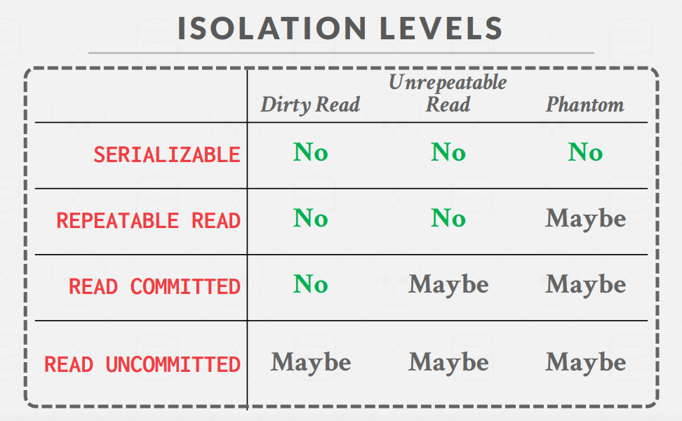

完结撒花！临近期末周了，来摸摸鱼记录一下 Bustub Concurrency Control 的实现过程。

非常感谢 CMU 慷慨地开源如此优质的课程。

## Resources

- [https://15445.courses.cs.cmu.edu/fall2022](https://15445.courses.cs.cmu.edu/fall2022) 课程官网
- [https://github.com/cmu-db/bustub](https://github.com/cmu-db/bustub) Bustub Github Repo
- [https://www.gradescope.com/](https://www.gradescope.com/) 自动测评网站 GradeScope，course entry code: PXWVR5
- [https://discord.gg/YF7dMCg](https://discord.gg/YF7dMCg) Discord 论坛，课程交流用
- bilibili 有搬运的课程视频，自寻。

**请不要将实现代码公开，尊重 Andy 和 TAs 的劳动成果！**

## Overview

Project 4 是 15-445 2022Fall 的最后一个部分了，在这里我们将为 Bustub 实现关系数据库中极其重要的 transaction 概念。难度上来说个人感觉 Project 2 >> 4 > 3 ≈ 1。Project 4 实现难度还是不小的，分为三个部分：

- Lock Manager：锁管理器，利用 2PL 实现并发控制。支持 `REPEATABLE_READ`、`READ_COMMITTED` 和 `READ_UNCOMMITTED` 三种隔离级别，支持 `SHARED`、`EXCLUSIVE`、`INTENTION_SHARED`、`INTENTION_EXCLUSIVE` 和 `SHARED_INTENTION_EXCLUSIVE` 五种锁，支持 table 和 row 两种锁粒度，支持锁升级。Project 4 重点部分。
- Deadlock Detection：死锁检测，运行在一个 background 线程，每间隔一定时间检测当前是否出现死锁，并挑选合适的事务将其 abort 以解开死锁。
- Concurrent Query Execution：修改之前实现的 `SeqScan`、`Insert` 和 `Delete` 算子，加上适当的锁以实现并发的查询。

## Task 1 Lock Manager

大部分需要注意的内容都在 `lock_manager.h` 的 LOCK NOTE 和 UNLOCK NOTE 里了。在开始实现前务必阅读。

首先理一理 Lock Manager 的结构：

- `table_lock_map_`：记录 table 和与其相关锁请求的映射关系。
- `row_lock_map_`：记录 row 和与其相关锁请求的映射关系。

这两个 map 的值均为锁请求队列 `LockRequestQueue`：

- `request_queue_`：实际存放锁请求的队列。
- `cv_` & `latch_`：条件变量和锁，配合使用可以实现经典的等待资源的模型。
- `upgrading_`：正在此资源上尝试锁升级的事务 id。

锁请求以 `LockRequest` 类表示：

- `txn_id_`：发起此请求的事务 id。
- `lock_mode_`：请求锁的类型。
- `oid_`：在 table 粒度锁请求中，代表 table id。在 row 粒度锁请求中，表示 row 属于的 table 的 id。
- `rid_`：仅在 row 粒度锁请求中有效。指 row 对应的 rid。
- `granted_`：是否已经对此请求授予锁？

Lock Manager 的作用是处理事务发送的锁请求，例如有一个 SeqScan 算子需要扫描某张表，其所在事务就需要对这张表加 S 锁。而加读锁这个动作需要由 Lock Manager 来完成。事务先对向 Lock Manager 发起加 S 锁请求，Lock Manager 对请求进行处理。如果发现此时没有其他的锁与这个请求冲突，则授予其 S 锁并返回。如果存在冲突，例如其他事务持有这张表的 X 锁，则 Lock Manager 会阻塞此请求（即阻塞此事务），直到能够授予 S 锁，再授予并返回。

现在可能还有点迷糊，接下来理一理 lock 和 unlock 的整个过程应该就比较清晰了。

### Lock

以 table lock 为例。首先需要注意，Project 4 中细节极多，每次操作都有很多状态需要同步和维护，因此尽量遵循防御性编程的理念，多用 assert，确保系统处于预期的状态。

**第一步，检查 txn 的状态。**

若 txn 处于 Abort/Commit 状态，抛逻辑异常，不应该有这种情况出现。

若 txn 处于 Shrinking 状态，则需要检查 txn 的隔离级别和当前锁请求类型：

```
REPEATABLE_READ:
   The transaction is required to take all locks.
   All locks are allowed in the GROWING state
   No locks are allowed in the SHRINKING state
   
READ_COMMITTED:
   The transaction is required to take all locks.
   All locks are allowed in the GROWING state
   Only IS, S locks are allowed in the SHRINKING state
   
READ_UNCOMMITTED:
   The transaction is required to take only IX, X locks.
   X, IX locks are allowed in the GROWING state.
   S, IS, SIX locks are never allowed
```

三种隔离级别翻译成中文分别是可重复读、读已提交、读未提交。另外 lecture 中一直提到的 `SERIALIZABLE` 可串行化隔离级别在 Project 4 中无需实现。实现 `SERIALIZABLE` 需要在 `REPEATABLE_READS` 的基础上加上 index lock。这里我们无需关注 index lock。

以下是 15-445 Lecture 17 slides 中的截图，介绍了不同隔离级别下可能出现的异常情况：



不同的隔离级别其实是性能与一致性的权衡。关于隔离级别的更多内容可以看看 15-445 的 Lecture。

在 Project 4 中仅需支持除了 `SERIALIZABLE` 外的剩下三种隔离级别。若 txn 处于 Shrinking 状态：

- 在 `REPEATABLE_READ` 下，造成事务终止，并抛出 `LOCK_ON_SHRINKING` 异常。
- 在 `READ_COMMITTED` 下，若为 IS/S 锁，则正常通过，否则抛 `LOCK_ON_SHRINKING`。
- 在 `READ_UNCOMMITTED` 下，若为 IX/X 锁，抛 `LOCK_ON_SHRINKING`，否则抛 `LOCK_SHARED_ON_READ_UNCOMMITTED`。

若 txn 处于 Growing 状态，若隔离级别为 `READ_UNCOMMITTED` 且锁类型为 S/IS/SIX，抛 `LOCK_SHARED_ON_READ_UNCOMMITTED`。其余状态正常通过。

第一步保证了锁请求、事务状态、事务隔离级别的兼容。正常通过第一步后，可以开始尝试获取锁。

**第二步，获取 table 对应的 lock request queue。**

从 `table_lock_map_` 中获取 table 对应的 lock request queue。注意需要对 map 加锁，并且为了提高并发性，在获取到 queue 之后立即释放 map 的锁。若 queue 不存在则创建。

**第三步，检查此锁请求是否为一次锁升级。**

首先，记得对 queue 加锁。

granted 和 waiting 的锁请求均放在同一个队列里，我们需要遍历队列查看有没有与当前事务 id（我习惯叫做 tid）相同的请求。如果存在这样的请求，则代表当前事务在此前已经得到了在此资源上的一把锁，接下来可能需要锁升级。需要注意的是，这个请求的 `granted_` 一定为 true。因为假如事务此前的请求还没有被通过，事务会被阻塞在 LockManager 中，不可能再去尝试获取另一把锁。

现在我们找到了此前已经获取的锁，开始尝试锁升级。首先，判断此前授予锁类型是否与当前请求锁类型相同。若相同，则代表是一次重复的请求，直接返回。否则进行下一步检查。

接下来，判断当前资源上是否有另一个事务正在尝试升级（`queue->upgrading_ == INVALID_TXN_ID`）。若有，则终止当前事务，抛出 `UPGRADE_CONFLICT` 异常。因为不允许多个事务在同一资源上同时尝试锁升级。

> [LOCK UPGRADE] Furthermore, only one transaction should be allowed to upgrade its lock on a given resource. Multiple concurrent lock upgrades on the same resource should set the TransactionState as ABORTED and throw a TransactionAbortException (UPGRADE_CONFLICT).

为什么不允许？我忘了。。。我记得在实现的过程中突然灵感一闪，领悟出为何不允许多事务同时进行锁升级（也可能是当时就想错了），但由于没有及时记录，时间间隔有点久，现在想不起来了。之后再慢慢想想到底是为了降低实现复杂度还是有什么其他的特殊考量。

然后，判断升级锁的类型和之前锁是否兼容，不能反向升级。

> While upgrading, only the following transitions should be allowed:
> IS -> [S, X, IX, SIX]
> S -> [X, SIX]
> IX -> [X, SIX]
> SIX -> [X]

若不兼容，抛 `INCOMPATIBLE_UPGRADE` 异常。

现在，我们终于可以进行锁升级了。引用 [Discord](https://discord.com/channels/724929902075445281/1014055970634215434) 里 15-445 TA 的原话，锁升级可以被拆分成三个步骤：

1. 可以升级吗？即我们此前的一系列判断。
2. 释放当前已经持有的锁，并在 queue 中标记我正在尝试升级。
3. 等待直到新锁被授予。

需要特别注意的是，在锁升级时，需要先释放此前持有的锁，把升级作为一个新的请求加入队列。之前我以为在锁升级时要一直持有此前的锁，直到能够升级时，再直接修改锁的类型。按此实现之后被一个 test case 卡到怀疑人生。

锁升级的步骤大概就是这样。当然，假如遍历队列后发现不存在与当前 tid 相同的请求，就代表这是一次平凡的锁请求。

**第四步，将锁请求加入请求队列。**

new 一个 LockRequest，加入队列尾部。实际上这里 LockRequest 不应该设计成裸指针，不方便管理，之后要记得手动释放。最好用智能指针。没用智能指针的原因是忘了（不过完全可以自己改成智能指针。

这里采用一条队列，把 granted 和 waiting 的请求放在一起，个人感觉不是特别清晰。或许可以改成一条 granted 队列和一条 waiting 队列。

**第五步，尝试获取锁。**

这是最后一步，也是最核心的一步，体现了 Lock Manager 的执行模型。首先，需要清楚条件变量的使用场景。

条件变量并不是某一个特定语言中的概念，而是操作系统中线程同步的一种机制。先给出条件变量经典的使用形式：

```cpp
std::unique_lock<std::mutex> lock(latch);
while (!resource) {
    cv.wait(lock);
}
```

条件变量与互斥锁配合使用。首先需要持有锁，并查看是否能够获取资源。这个锁与资源绑定，是用来保护资源的锁。若暂时无法获取资源，则调用条件变量的 wait 函数。调用 wait 函数后，latch 将自动**释放**，并且当前线程被挂起，以节省资源。这就是阻塞的过程。此外，允许有多个线程在 wait 同一个 latch。

当其他线程的活动使得资源状态发生改变时，需要调用条件遍历的 `notify_all()` 函数。即

```cpp
// do something changing the state of resource...
cv.notify_all();
```

`notify_all()` 可以看作一次广播，会唤醒所有正在此条件变量上阻塞的线程。在线程被唤醒后，其仍处于 wait 函数中。在 wait 函数中尝试获取 latch。在成功获取 latch 后，退出 wait 函数，进入循环的判断条件，检查是否能获取资源。若仍不能获取资源，就继续进入 wait 阻塞，释放锁，挂起线程。若能获取资源，则退出循环。这样就实现了阻塞等待资源的模型。条件变量中的条件指的就是满足某个条件，在这里即能够获取资源。

理解条件变量的作用后，就可以写出如下代码：

```cpp
std::unique_lock<std::mutex> lock(queue->latch_);
while (!GrantLock(...)) {
    queue->cv_.wait(lock);
}
```

在 `GrantLock()` 中，Lock Manager 会判断是否可以满足当前锁请求。若可以满足，则返回 true，事务成功获取锁，并退出循环。若不能满足，则返回 false，事务暂时无法获取锁，在 wait 处阻塞，等待资源状态变化时被唤醒并再次判断是否能够获取锁。资源状态变化指的是什么？其他事务释放了锁。

接下来是 `GrantLock()` 函数。在此函数中，我们需要判断当前锁请求是否能被满足。

1. 判断兼容性。遍历请求队列，查看当前锁请求是否与所有的已经 granted 的请求兼容。需要注意的是，在我的实现中 granted 请求不一定都在队列头部，因此需要完全遍历整条队列。锁兼容矩阵可以在 Lecture slides 中查看。若全部兼容，则通过检查。否则直接返回 false。当前请求无法被满足。

2. 判断优先级。锁请求会以严格的 FIFO 顺序依次满足。只有当前请求为请求队列中优先级最高的请求时，才允许授予锁。优先级可以这样判断：
   - 如果队列中存在锁升级请求，若锁升级请求正为当前请求，则优先级最高。否则代表其他事务正在尝试锁升级，优先级高于当前请求。
   - 若队列中不存在锁升级请求，则遍历队列。如果，当前请求是第一个 waiting 状态的请求，则代表优先级最高。如果当前请求前面还存在其他 waiting 请求，则要判断当前请求是否前面的 waiting 请求兼容。若兼容，则仍可以视为优先级最高。若存在不兼容的请求，则优先级不为最高。

这么说可能比较抽象，举几个具体的例子：
```cpp
X(waiting) X(upgrading)
            ^ current
Current request is upgrading. Highest priority.                      
--------------------------------------------------
X(waiting) S(waiting)
            ^ current
Current request is incompatible with the first request. 
Not highest priority.
--------------------------------------------------
S(waiting) S(waiting)
            ^ current
Although current request is not the first waiting request,
it is compatible with the first request. Highest priority.         
```

其他的情况都比较好理解，遵循升级请求优先级最高和 FIFO 的原则。但最后一种情况可能稍微不太好理解。之所以要这么做是因为 LOCK NOTE 里有这么一句话：

> If there are multiple compatible lock requests, all should be granted at the same time as long as FIFO is honoured.

所有兼容的锁请求需要一起被授予。

两项检查通过后，代表当前请求既兼容又有最高优先级，因此可以授予锁。授予锁的方式是将 `granted_` 置为 true。并返回 true。假如这是一次升级请求，则代表升级完成，还要记得将 `upgrading_` 置为 `INVALID_TXN_ID`。

另外，需要进行一些 Bookkeeping 操作。Transaction 中需要维护许多集合，分别记录了 Transaction 当前持有的各种类型的锁。方便在事务提交或终止后全部释放。

Lock 的流程大致如此，row lock 与 table lock 几乎相同，仅多了一个检查步骤。在接收到 row lock 请求后，需要检查是否持有 row 对应的 table lock。必须先持有 table lock 再持有 row lock。

### Unlock

仍以 table lock 为例。Unlock 的流程比 Lock 要简单不少。

首先，由于是 table lock，在释放时需要先检查其下的所有 row lock 是否已经释放。

接下来是 table lock 和 row lock 的公共步骤：

**第一步，获取对应的 lock request queue。**

**第二步，遍历请求队列，找到 unlock 对应的 granted 请求。**

若不存在对应的请求，抛 `ATTEMPTED_UNLOCK_BUT_NO_LOCK_HELD` 异常。

找到对应的请求后，根据事务的隔离级别和锁类型修改其状态。

当隔离级别为 `REPEATABLE_READ` 时，S/X 锁释放会使事务进入 Shrinking 状态。当为 `READ_COMMITTED` 时，只有 X 锁释放使事务进入 Shrinking 状态。当为 `READ_UNCOMMITTED` 时，X 锁释放使事务 Shrinking，S 锁不会出现。

之后，在请求队列中 remove unlock 对应的请求，并将请求 delete。

同样，需要进行 Bookkeeping。

在锁成功释放后，调用 `cv_.notify_all()` 唤醒所有阻塞在此 table 上的事务，检查能够获取锁。

Task 1 的内容就是这样，核心是条件变量阻塞模型，此外细枝末节还是挺多的，需要细心维护。

## Task 2 Deadlock Detection

在阻塞过程中有可能会出现多个事务的循环等待，而循环等待会造成死锁。在 Bustub 中我们采用一个 background Deadlock Detection 线程来定时检查当前是否出现死锁。

我们用 wait for 图来表示事务之间的等待关系。wait for 是一个有向图，`t1->t2` 即代表 t1 事务正在等待 t2 事务释放资源。当 wait for 图中存在环时，即代表出现死锁，需要挑选事务终止以打破死锁。

我们并不需要时刻维护 wait for 图，而是在死锁检测线程被唤醒时，根据当前请求队列构建 wait for 图，再通过 wait for 图判断是否存在死锁。当判断完成后，将丢弃当前 wait for 图。下次线程被唤醒时再重新构建。

最常见的有向图环检测算法包括 DFS 和拓扑排序。在这里我们选用 DFS 来进行环检测。构建 wait for 图时要保证搜索的确定性。始终从 tid 较小的节点开始搜索，在选择邻居时，也要优先搜索 tid 较小的邻居。

构建 wait for 图的过程是，遍历 `table_lock_map` 和 `row_lock_map` 中所有的请求队列，对于每一个请求队列，用一个二重循环将所有满足等待关系的一对 tid 加入 wait for 图的边集。满足等待关系是指，例如二元组 (a, b)，a 是 waiting 请求，b 是 granted 请求，并且 a 与 b 的锁不兼容，则生成 `a->b` 一条边。

在成功构建 wait for 图后，对 wait for 图实施环检测算法。具体的算法就不说了，正好可以复习复习有向图环检测。有一点需要注意，这个环检测算法不仅需要输出是否存在环，假如存在环，还要输出环上的所有节点。因为之后我们需要在这些成环的节点里挑选合适的事务进行终止。

在发现环后，我们可以得到环上的所有节点。此时我们挑选 **youngest** 的事务将其终止。这里的 **youngest** 如何理解呢？一开始我以为是事务到达的时间，因此我维护了一张 map，记录了每个事务最后一次发起锁请求的逻辑时间戳，挑选时间戳最大的事务终止。在提交测试后我懵了。有一个死锁检测 test case 在返回需要 abort 的事务时，一直返回 -1（`INVALID_TXN_ID`）。这个测试会绕过 Lock Manager 直接构建 wait for 图来验证是否终止了 youngest 的事务。因此，我又成小丑了，实际上只用挑选 tid 最大的事务作为 youngest 事务终止即可。

挑选出 youngest 事务后，将此事务的状态设为 Aborted。并且在请求队列中移除此事务，释放其持有的锁，终止其正在阻塞的请求，并调用 `cv_.notify_all()` 通知正在阻塞的相关事务。此外，还需移除 wait for 图中与此事务有关的边。不是不用维护 wait for 图，每次使用重新构建吗？这是因为图中可能存在多个环，不是打破一个环就可以直接返回了。需要在死锁检测线程醒来的时候打破当前存在的所有环。

写到这里，不难发现我们之前的阻塞模型需要进行一定的修改：

```cpp
std::unique_lock<std::mutex> lock(queue->latch_);
while (!GrantLock(...)) {
    queue->cv_.wait(lock);
    if (txn->GetState() == Aborted) {
        // release resources
        return false;
    }
}
```

在事务被唤醒时，其可能已经被终止掉了。原因可能是死锁检测中将其终止，也可能是外部的一些原因造成终止。因此需要检测是否处于 Aborted 状态，若处于则释放所持资源并返回。

Task 2 的内容就是这些，核心是环检测算法。

## Task 3 Concurrent Query Execution

这一部分需要我们将 transaction 应用到之前实现的算子中，以支持并发的查询。比较简单。

我们仅需修改 `SeqScan`、`Insert` 和 `Delete` 三个算子。为什么其他的算子不需要修改？因为其他算子获取的 tuple 数据均为中间结果，并不是表中实际的数据。而这三个算子是需要与表中实际数据打交道的。其中 `Insert` 和 `Delete` 几乎完全一样，与 `SeqScan` 分别代表着写和读。

### SeqScan

在 `Init()` 函数中，为表加上 S 锁。如果隔离级别是 `READ_UNCOMMITTED` 则无需加锁。加锁失败则抛出 `ExecutionException` 异常。

在 `Next()` 函数中，若表中已经没有数据，则释放之前持有的锁。

### Insert & Delete

在 `Init()` 函数中，为表加上 X 锁。实际上为表加 IX 锁再为行加 X 锁应该也可以，我这里图省事就直接用大锁了。同样，若获取失败则抛 `ExecutionException` 异常。另外，这里的获取失败不仅是结果返回 false，还有可能是抛出了 `TransactionAbort()` 异常，例如 `UPGRADE_CONFLICT`，需要用 try catch 捕获。

在 `Next()` 函数需要返回 false 前，释放持有的 X 锁。

另外，在 Notes 里提到的

> you will need to maintain the write sets in transactions

似乎 `InsertTuple()` 函数里已经帮我们做好了，不需要维护 write set。而 index 的 write set 需要我们自己维护。当然，Project 4 并不需要考虑 index，不维护代码也能过。

## Summary

这就是 Project 4 或者说 CMU15-445 2022Fall Projects 的全部内容了。在 Project 4 里手写了一个锁管理器，为 Bustub 提供以 2PL 为基础的并发查询和事务模型，收获同样很大。另外老实说由于快到期末周了，这篇记录写的比较仓促，没有讨论太多设计的理念，仅仅是记录了一下实现过程，写的比较水，还请见谅。

整个 15-445 Projects 做下来花了差不多 150 个小时的时间，还仅仅是编码时间，不包括看 Lecture 等等，但做完这门课我的收获可能比在某高校学习的所有课加起来还大。真正地完成了我对数据库领域的启蒙教育。

感谢 CMU 慷慨地提供如此优质的教学资源，开放了 AutoGrader 测评，感谢 Andy 的教学，感谢 15-445 TAs 在 non-CMU Discord 里对各种问题的解答。

最后，写下这个系列的初衷是为了自己能够更好地理解知识，复盘实现过程，以后完全看不懂自己曾经写了啥的时候也可以来看看当时的想法。另外，假如这些能够为朋友们或后来者提供一些微小的帮助，便是再好不过了。