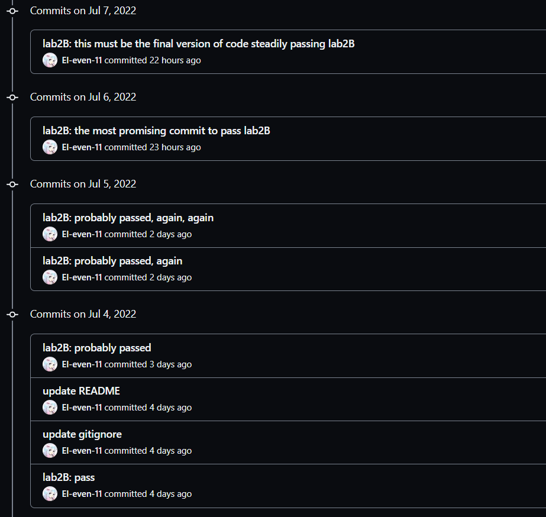

趁着暑假有空，把鸽了很久的 MIT6.824 做一下。Lab1 是实现一个 Map-Reduce，因为和 Raft 主线关系不大（因为懒），就略过了。另外，这次尝试实现一个 part 就来记录相关的内容，以免在全部实现后忘记部分细节（以免之后太懒不想写）。因此，不同 part 的代码会变化，请以最终版本的代码为准（但保证每一 part 的代码可以正常通过**绝大部分**相应的测试）。同时，在写下某一 part 的记录时，我对 Raft 的整体把握也难免有所不足。

# Resources

- [Course's Page](https://pdos.csail.mit.edu/6.824/index.html) 课程主页
- [Students' Guide to Raft](https://thesquareplanet.com/blog/students-guide-to-raft/) 一篇引导博客
- [Debugging by Pretty Printing](https://blog.josejg.com/debugging-pretty/) debug 技巧，**强烈推荐阅读和运用**
- [Raft Q&A](https://thesquareplanet.com/blog/raft-qa/) 关于 Raft 的一些 Q&A
- [Raft Visualization](https://raft.github.io/) Raft 动画演示


# Lab2A Raft Leader Election
Lab2A 实现时间为6.22~6.24。

Lab2A 主要实现 Raft 的选主过程，包括选举出 Leader 和 Leader 通过心跳维持身份。


## Design

首先是选主过程的状态机模型：


接下来是 Raft 论文中最为重要的 Figure 2:


Figure 2 有许多关于日志复制等其他部分的内容，在这里暂时先不考虑（但当然还是推荐先整体熟悉 Raft 所有内容后再开始编码）。关于选举部分的内容已经全部在图中标出。一个一个看：

### State

每个 Raft 节点需要维护的状态：

- `currentTerm` 此节点的任期。
- `votedFor` 在当前任期内，此节点将选票投给了谁。**一个任期内，节点只能将选票投给某一个节点**。因此当节点任期更新时要将 `votedfor` 置为 null。


### AppendEntries RPC

在领导选举的过程中，`AppendEntries RPC` 用来实现 Leader 的心跳机制。节点的 `AppendEntries RPC` 会被 Leader 定期调用。

**Args**

- `term` Leader 的任期。
- `leaderId` Client 可能将请求发送至 Follower 节点，得知 `leaderId` 后 Follower 可将 Client 的请求重定位至 Leader 节点。因为 Raft 的请求信息必须先经过 Leader 节点，再由 Leader 节点流向其他节点进行同步，信息是单向流动的。**在选主过程中**，`leaderId` **暂时只有 debug 的作用**。

**Reply**

- `term` 此节点的任期。假如 Leader 发现 Follower 的任期高于自己，则会放弃 Leader 身份并更新自己的任期。
- `success` 此节点是否认同 Leader 发送的心跳。

**Receiver Implementation**

1. 当 Leader 任期小于当前节点任期时，返回 false。
2. 否则返回 true。


### RequestVote RPC

`RequestVote RPC` 会被 Candidate 调用，以此获取选票。

**Args**

- `term` Candidate 的任期
- `candidateId`

**Reply**

- `term` 此节点的任期。假如 Candidate 发现 Follower 的任期高于自己，则会放弃 Candidate 身份并更新自己的任期。
- `voteGranted` 是否同意 Candidate 当选。

**Receiver Implementation**

1. 当 Candidate 任期小于当前节点任期时，返回 false。
2. 如果 `votedFor` 为 null（即当前任期内此节点还未投票）或者 `votedFor`为 `candidateId`（即当前任期内此节点已经向此 Candidate 投过票），则同意投票；否则拒绝投票。


### Rules for Servers

**All Servers**

- 如果来自其他节点的 RPC 请求中，或发给其他节点的 RPC 的回复中，任期高于自身任期，则更新自身任期，并转变为 Follower。

**Followers**

- 响应来自 Candidate 和 Leader 的 RPC 请求。
- 如果在 election timeout 到期时，Follower 未收到来自当前 Leader 的 AppendEntries RPC，也没有收到来自 Candidate 的 RequestVote RPC，则转变为 Candidate。

**Candidates**

- 转变 Candidate时，开始一轮选举：
  - currentTerm++
  - 为自己投票（votedFor = me）
  - 重置 election timer
  - 向其他所有节点**并行**发送 RequestVote RPC
- 如果收到了大多数节点的选票（voteCnt > n/2），当选 Leader。
- 在选举过程中，如果收到了来自新 Leader 的 AppendEntries RPC，停止选举，转变为 Follower。
- 如果 election timer 超时时，还未当选 Leader，则放弃此轮选举，开启新一轮选举。

**Leaders**

- 刚上任时，向所有节点发送一轮心跳信息
- 此后，每隔一段固定时间，向所有节点发送一轮心跳信息，重置其他节点的 election timer，以维持自己 Leader 的身份。


至此，选主的流程已经比较清晰，接下来是具体的实现。


## Implementation

需要实现的结构体不再赘述，按照 Figure2 来就行。

首先实现两个RPC:

### AppendEntries RPC

```go
func (rf *Raft) AppendEntries(args *AppendEntriesArgs, reply *AppendEntriesReply) {
	rf.mu.Lock()
	defer rf.mu.Unlock()
    
	if args.Term < rf.currentTerm {
        // Reply false if term < currentTerm
		reply.Success = false
		reply.Term = rf.currentTerm		
		return
	}

	if args.Term > rf.currentTerm {
        // If RPC request contains term T > currentTerm: 
        // set currentTerm = T, convert to follower
		rf.currentTerm = args.Term
		rf.votedFor = -1
		rf.state = FOLLOWER
	}

    // received AppendEntries RPC from current leader, reset election timer
	rf.electionTimer.Reset(randomElectionTimeout()) 

	reply.Success = true
	reply.Term = rf.currentTerm
}
```

### RequestVote RPC

```go
func (rf *Raft) RequestVote(args *RequestVoteArgs, reply *RequestVoteReply) {
	rf.mu.Lock()
	defer rf.mu.Unlock()

	if args.Term < rf.currentTerm {
		// Reply false if term < currentTerm
		reply.VoteGranted = false
		reply.Term = rf.currentTerm
		return
	}

	if args.Term > rf.currentTerm {
		// If RPC request contains term T > currentTerm:
		// set currentTerm = T, convert to follower
		rf.currentTerm = args.Term
		rf.votedFor = -1
		rf.state = FOLLOWER
	}

	if rf.votedFor != -1 && rf.votedFor != args.CandidateId {
		// If votedFor is null or candidateId, grant vote; otherwise reject
		reply.VoteGranted = false
		reply.Term = rf.currentTerm
		return
	}

	// grant vote to candidate, reset election timer
	rf.electionTimer.Reset(randomElectionTimeout())
	rf.votedFor = args.CandidateId

	reply.VoteGranted = true
	reply.Term = rf.currentTerm
}
```


可以看到两个 RPC 的实现与 Figure 2 中的规则完全一致。依次实现即可。需要注意的是，处理 RPC 的整个过程中都需要持有锁。另外，在更新节点任期时，一定要同步将`votedFor` 置为 null。

实现完两个 RPC 后，再实现较为复杂的 election 和 heartbeat 过程。


### Election

在节点的 election timer 过期后，开始选举。因此，节点需要有一个监控 electon timer 的 go routine，ticker。

```go
func (rf *Raft) ticker() {
	for !rf.killed() {
		select {
		case <-rf.electionTimer.C:
			rf.mu.Lock()
			if rf.state == LEADER {
				rf.mu.Unlock()
				break
			}
			rf.state = CANDIDATE
			rf.mu.Unlock()
			go rf.startElection()
		}
	}
}
```

选举过程的 go routine 为 startElection。为什么将选举过程也作为一个 go routine，而不是阻塞地调用函数？因为在规则中提到过，**如果 election timer 超时时，Candidate 还未当选 Leader，则放弃此轮选举，开启新一轮选举**。

接下来看实际负责选举过程的 go routine， startElection。

```go
func (rf *Raft) startElection() {
	rf.mu.Lock()
	rf.currentTerm++                                // Increment currentTerm
	rf.votedFor = rf.me                             // Vote for self
	rf.electionTimer.Reset(randomElectionTimeout()) // Reset election timer
	rf.mu.Unlock()

	args := RequestVoteArgs{CandidateId: rf.me}
	rf.mu.RLock()
	args.Term = rf.currentTerm
	rf.mu.RUnlock()

	voteCh := make(chan bool, len(rf.peers)-1)
	for i := range rf.peers { // Send RequestVote RPCs to all other servers
		if i == rf.me { // in PARALLEL
			continue
		}
		go func(i int) {
			reply := RequestVoteReply{}
			if ok := rf.sendRequestVote(i, &args, &reply); !ok {
				voteCh <- false
				return
			}
			rf.mu.Lock()
			if reply.Term > rf.currentTerm {
				// If RPC response contains term T > currentTerm:
				// set currentTerm = T, convert to follower
				rf.currentTerm = reply.Term
				rf.votedFor = -1
				rf.state = FOLLOWER
				rf.mu.Unlock()
				return
			}
			rf.mu.Unlock()
			voteCh <- reply.VoteGranted
		}(i)
	}

	voteCnt := 1
	voteGrantedCnt := 1
	for voteGranted := range voteCh {
		rf.mu.RLock()
		state := rf.state
		rf.mu.RUnlock()
		if state != CANDIDATE {
			break
		}
		if voteGranted {
			voteGrantedCnt++
		}
		if voteGrantedCnt > len(rf.peers)/2 {
			// gain over a half votes, switch to leader
			rf.mu.Lock()
			rf.state = LEADER
			rf.mu.Unlock()
			go rf.heartbeat()
			break
		}

		voteCnt++
		if voteCnt == len(rf.peers) {
			// election completed without getting enough votes, break
			break
		}
	}
}
```

使用 n-1 个协程向其他节点并行地发送 RequestVote 请求。协程获得 response 后，向 `voteCh` 发送结果，startElection 协程进行结果统计。统计过程中，若发现失去了 Candidate 身份，则停止统计。若获得票数过半，则成功当选 Leader，启动 heartbeat 协程。若所有成员已投票，且未当选 Leader，则退出统计。

要注意的是，需要确保所有不再使用的 go routine 能够正常退出，避免占据资源。

成功当选 Leader 后，开始发送心跳。


### Heartbeat

```go
func (rf *Raft) heartbeat() {
	wakeChPool := make([]chan struct{}, len(rf.peers))
	doneChPool := make([]chan struct{}, len(rf.peers))
	// allocate each peer with a go routine to send AppendEntries RPCs
	for i := range rf.peers {
		if i == rf.me {
			continue
		}
		wakeChPool[i] = make(chan struct{})
		doneChPool[i] = make(chan struct{})
		go func(i int) { // replicator go routine
			for {
				select {
				case <-wakeChPool[i]:
					args := AppendEntriesArgs{LeaderId: rf.me}
					reply := AppendEntriesReply{}
					rf.mu.RLock()
					args.Term = rf.currentTerm
					rf.mu.RUnlock()

					go func() {
						if ok := rf.sendAppendEntries(i, &args, &reply); !ok {
							return
						}
						rf.mu.Lock()
						if reply.Term > rf.currentTerm {
							rf.currentTerm = reply.Term
							rf.votedFor = -1
							rf.state = FOLLOWER
							rf.mu.Unlock()
							return
						}
						rf.mu.Unlock()
					}()
				case <-doneChPool[i]:
					return
				}
			}
		}(i)
	}

	broadcast := func() {
		for i := range rf.peers {
			if i == rf.me {
				continue
			}
			go func(i int) {
				wakeChPool[i] <- struct{}{}
			}(i)
		}
	}
	broadcast()

	rf.heartbeatTimer = time.NewTimer(HEARTBEAT_INTERVAL)
	for {
		<-rf.heartbeatTimer.C
		if rf.killed() || !rf.isLeader() {
			break
		}
		rf.heartbeatTimer.Reset(HEARTBEAT_INTERVAL)
		broadcast()
	}

	// killed or no longer the leader, release go routines
	for i := range rf.peers {
		if i == rf.me {
			continue
		}
		go func(i int) {
			doneChPool[i] <- struct{}{}
		}(i)
	}
}
```

heartbeat 协程首先为每个节点分配一个 replicator 协程，每个 replicator 协程负责向一个特定的节点发送 AppendEntries RPC。

这些协程由 `wakeChPool[i]` 唤醒。实际上也可以用 `sync.Cond` 条件变量实现，但我不太会用，所以简单地用一组 channel 模拟。

初始化这些协程后，heartbeat 协程首先进行一个初始的 broadcast，对应 Leader 刚当选时发出的一轮心跳。broadcast 即通过 `wakeChPool` 唤醒所有 replicator 协程，向所有节点发出一次心跳。

此后，heartbeat 协程初始化一个 heartbeatTimer，并且在每次 heartbeatTimer 到期时，进行一次 broadcast，通知所有 replicator 协程发送一次心跳。这里需要注意的是，如果节点已经被 kill 或者不再是 Leader，需要中断对 heartbeatTimer 的监听，并且释放所有 replicator 协程。

至此，选主过程和心跳成功实现。


## Devil in the details

Lab2A 难度不算大，然而我还是被一个细节卡住了挺久。

在 6.824 Raft 实验中，已经给我们提供了 RPC 调用的方法，即

```go
rf.peers[server].Call("Raft.RPCName", args, reply)
```

其注释提到，

> Call() is guaranteed to return (perhaps after a delay) *except* if the handler function on the server side does not return.  Thus there is no need to implement your own timeouts around Call().

Call() 是确保一定会返回的，除非在被调用的RPC中阻塞，否则即使模拟的网络中断，Call() 也会正常返回 false。因此不需要再为 Call() 设置一个 Timeout 限制。

然而，经过测试，Call() 的确会确保返回，但返回的时间可能会非常长（3到4秒，具体数值要阅读 labrpc 源码，我还没有仔细阅读）。因此，在 replicator 协程中，每次发送心跳，我们还要再启动一个协程，将 sendAppendEntries 放在此协程中运行，避免哪怕只有几秒钟的阻塞。因为在这几秒中，Leader 可能又发送了新的 heartbeat，或者 Leader 不再是 Leader。

```go
go func(i int) { // replicator go routine
	for {
		select {
		case <-wakeChPool[i]:
			...
			go func() { // launch a new go routine to run sending RPC
				if ok := rf.sendAppendEntries(i, &args, &reply); !ok {
					return
				}
			}()
		case <-doneChPool[i]:
			return
		}
		...
	}
}(i)
```


## Summary

个人感觉 Lab2A 难度最大的地方在于合理控制各个 go routine 的生命周期。锁倒是暂时没碰到什么问题，直接一股脑地把可能存在 data race 的地方全部锁上并及时释放就好。整个选主过程的 go routine 生命周期如下：


Lab2A Leader Election 完成。


# Lab2B Raft Log Replication

Lab2B 开始于 6.28。结束于7.7。

和 Raft 最核心的部分缠斗了一个多星期，终于敢说完成了一个较为稳定的版本，千次测试无一 fail。这段时间摸摸鱼，陪陪女朋友，玩玩游戏（和朋友们一起玩一款叫 Raft 的海上生存游戏，挺巧），无聊的时候再看看 fail 掉的 log，暑假嘛，开心最重要。

关于 Lab2B 感触最深的就是 [Students' Guide to Raft](https://thesquareplanet.com/blog/students-guide-to-raft/) 里的这两段话：

> At first, you might be tempted to treat Figure 2 as sort of an informal guide; you read it once, and then start coding up an implementation that follows roughly what it says to do. Doing this, you will quickly get up and running with a mostly working Raft implementation. And then the problems start.

> Inevitably, the first iteration of your Raft implementation will be buggy. So will the second. And third. And fourth.

完成第一版可以单次 pass 的代码大概用了5个小时左右，接下来信心满满地进行千次测试。然而随后的大部分时间，我基本都在试图从各种诡异的 log 找出出现概率极低的难以复现的 Bug。




## Design

首先还是 Figure 2：


Lab2B 中需要完成 Figure 2 中余下的所有内容。顺带一提的是，Figure 2 与其说是一个 Raft 行为的汇总，更像是一个 coding 的 instruction。Figure 2 中很多地方直接给出了代码的具体行为，而不是给出比较抽象和模糊的规则。这样的好处是，coding 更加简单了，严格遵守 Figure 2 即可；但也有一定的坏处，可能实现完所有部分后，学生（特指我）还是对 Raft 的行为，设计和一致性证明等等比较模糊，仅是机械地遵循了 Figure 2 中给出的规则。下面还是一个一个来介绍：

### State

- `log[]` 即日志，每条 Entry 包含一条待施加至状态机的命令。Entry 也要记录其被发送至 Leader 时，Leader 当时的任期。Lab2B 中，在内存存储日志即可，不用担心 server 会 down 掉，测试中仅会模拟网络挂掉的情景。
- `commitIndex` 已知的最高的**已提交**的 Entry 的 index。**被提交**的定义为，当 Leader 成功在大部分 server 上复制了一条 Entry，那么这条 Entry 就是一条**已提交**的 Entry。
- `lastApplied` 最高的**已应用**的 Entry 的 index。已提交和已应用是不同的概念，已应用指这条 Entry 已经被运用到状态机上。已提交先于已应用。同时需要注意的是，Raft 保证了已提交的 Entry 一定会被应用（通过对选举过程增加一些限制，下面会提到）。


### AppendEntries RPC

