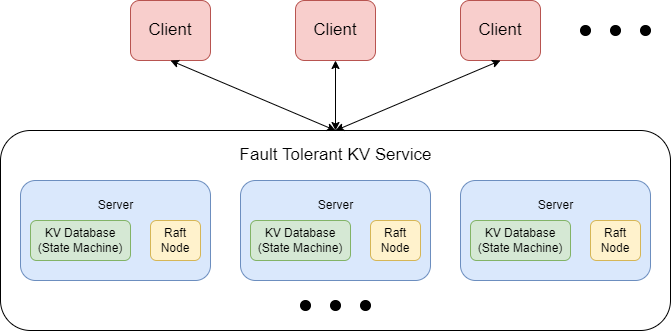

## Introduction

摸了一段时间的鱼，去尝试用 SpringBoot + Vue 搭建一个前后端分离的 Web 应用。都说 CS 的学生不能只会用框架 CRUD，但更不能不会用框架 CRUD。大概做出来一个小 demo 后就没有再继续了。接着来做 6.824。

Lab3 和 Lab2 各有各的难处。Lab2 是 Raft 的核心，需要小心地处理各种 corner case。但好在有 Figure2 的引导，最终也是按照其严格的规定成功实现。Lab3 编码难度不如 Lab2，但没有详细的引导，留给个人自由发挥的空间更大 (更有可能不知道从何下手)。


Lab3 需要在 Raft 层上实现一个 fault-tolerant key-value service，满足强一致性，也就是线性一致性 (Linearizable Consistency)。线性一致性保证整个系统看起来好像只有一个副本，其中所有的操作都是原子性的。简单地说，线性一致性系统的读写操作有以下特征：

- 读写并不能瞬间完成，而是在一个时间段内进行。
- 读在写开始前完成，读到的一定是旧值；读在写完成之后开始，读到的一定是新值。(读写操作无重合部分)
- 读写并发进行，即有重合部分时，既可能读到新值，也可能读到旧值。
- 一旦有一个客户端读取到了新值，那么之后的客户端一定也都会读取到新值。

关于线性一致性更加详细的定义和解析，可以阅读《数据密集型应用系统》(DDIA) 相关章节。


先来看看整个系统的架构：



整个 KV Service 由多个 Server 组成，每个 Server 包含一个 State Machine，具体在 lab 中是一个 KV 数据库；Server 还包含一个 Raft 节点。需要注意的是，各 Server 之间并不会直接通信，而是靠其 Raft 节点进行通信。

整个系统的理想运行流程是：

- Client 通过 RPC 向 KV Service 发送请求，例如 Put(x,1)
- KV Service 将请求转发给当前拥有 Leader Raft 节点的 Server
- Leader Server 将请求包含的 command 传递给 Raft 层
- Raft 层对 command 进行共识，生成相同的 log replica
- 在达成共识后，Raft 层将 command Apply 回 Server
- Server 收到 Raft 层的 Apply 后，将 command 应用到状态机，即状态机此时状态为 {x: 1}
- 成功应用至状态机后，Server 对 Client 的 RPC 进行回复，返回结果和错误码。

当系统能够正常运行时，一切看起来都很清晰美好。但是一旦出现问题，如节点挂掉、RPC丢包、网络分区等等，情况就变得比较复杂了。


## Implement

在 Lab3 中，我们主要需要实现的部分是 Client 、 Server 和 Server KV Database。

### KV Database

在 lab 中，KV 数据库并不是主要内容。因此直接用 Hashmap 模拟即可。键值均为 String。

```go
type kvdb struct {
	m  map[string]string
}

func (db *kvdb) put(key string, value string) {
	db.m[key] = value
}

func (db *kvdb) append(key string, value string) {
	db.m[key] += value
}

func (db *kvdb) get(key string) (string, Err) {
	if _, ok := db.m[key]; !ok {
		return "", ErrNoKey
	}
	return db.m[key], OK
}
```

在这里，我没有在 KV db 中使用单独的锁。因为这些操作在后续代码中都是互斥进行的，无需额外加锁。

### Client

Client 也相对简单。Client 可向 Server 发送三种不同的 RPC：`Put(key,value)`， `Append(key,arg)`和 `Get(key)`。Put 和 Append 均为写请求，Get 为读请求。

一开始，Client 并不知道 Leader Server 是哪台 Server。Client 可向随机一台 Server 发送 RPC 请求。假如请求的 Server 不是当前的 Leader Server，或者由于网络中断、Server Crash 等原因，无法与 Server 取得联系，则无限地尝试更换 Server 重新发送请求，直到请求成功被处理。这里有一个小优化，在得知 Leader Server 后，Client 可以保存 Leader 的 id，避免下次发起请求时又需要随机地选择一台 Server 多次尝试。

```go
type Clerk struct {
	servers []*labrpc.ClientEnd

	seq    int64 // write op index, increasing from 1
	id     int64 // client uuid
	leader int
}

func (ck *Clerk) Get(key string) string {
	args := GetArgs{
		Key:      key,
		ClientId: ck.id,
	}

	i := ck.leader

	defer func() {
		ck.leader = i
	}()

	for {
		reply := GetReply{}
		ok := ck.servers[i].Call("KVServer.Get", &args, &reply)
		if !ok || reply.Err == ErrWrongLeader || reply.Err == ErrTimeout {
			// cannot reach the server, or it's a wrong leader: retry
			i = (i + 1) % len(ck.servers)
			continue
		}

		if reply.Err == ErrNoKey {
			return ""
		}

		return reply.Value
	}
}

func (ck *Clerk) PutAppend(key string, value string, op string) {
	args := PutAppendArgs{
		Key:      key,
		Value:    value,
		Op:       op,
		Seq:      ck.seq,
		ClientId: ck.id,
	}

	i := ck.leader

	defer func() {
		ck.seq++
		ck.leader = i
	}()

	for {
		reply := PutAppendReply{}
		ok := ck.servers[i].Call("KVServer.PutAppend", &args, &reply)
		if !ok || reply.Err == ErrWrongLeader || reply.Err == ErrTimeout {
			// cannot reach the server, or it's a wrong leader: retry
			i = (i + 1) % len(ck.servers)
			continue
		}
		// successfully PutAppend
		return
	}
}
```

关于 Client 还需要维护的另一些状态，如 id 和 seq，待会儿再讨论。

### Server

Server 应该是 Lab3 中最为复杂的部分。我们先讨论一切正常的情况下 Server 的设计。

读写 RPC Handler 在接收到 Client 的请求后，通过调用 `raft.Start()` 将请求包含的 command 传递到 Raft 层，达成共识。当然，如果当前 Server 不为 Leader，则向 Client 返回 ErrWrongLeader 错误，Client 在收到回复后重新尝试向另一台 Server 发起请求。Raft 层达成共识后，通过 applyCh 通知 Server 该 command 已达成共识。

在一开始，可能会这样设计 Server：

```go
_, _, isLeader := kv.rf.Start(op) // push op to raft layer to reach the agreement
if !isLeader {
    reply.Err = ErrWrongLeader
    return
}
<- applyCh
// agreed! apply to statemachine
kv.apply(op)
```

对于不出错的单 Client，这样设计似乎没有问题。但如果有多个 Client 并行地向 Server 发起请求时，就显然不能保证从 applyCh 传回的数据恰好是此前提交的 command 了。为了解决这个问题，我们需要在 Server 中对特定的 command 进行等待。如何区分不同的 command？用 command 在 raft log 中的 index 区分即可。Server 需要维护一张 Map，Key 为 index，Value 为 Server 等待此 index 对应 command 的 channel。

```go
type Result struct {
	value string
	err   Err
}

notifyCh := map[int]chan Result
```

在 Raft 层，command 一定是按序向 applyCh 传输的。为了能够按序将 command 应用至状态机，Server 应起一后台 goroutine 监听 applyCh，对需要 apply 的 command 进行互斥的处理。同时，这个 goroutine 也负责将 applyCh 传来的信息转发给对应的正在阻塞等待的 RPC Handler：

```go
func (kv *KVServer) notifier() {
	for !kv.killed() {
		select {
		case msg := <-kv.applyCh:
			op := msg.Command.(Op)
			result := kv.apply(op)	// apply to state machine
            
			index := msg.CommandIndex
			ch := kv.getNotifyCh(index)	
			ch <- result	// notify the blocked server 
		}
	}
}

func (kv *KVServer) getNotifyCh(index int) chan Result {
	kv.mu.Lock()
	defer kv.mu.Unlock()
	if _, ok := kv.notifyCh[index]; !ok {
		kv.notifyCh[index] = make(chan Result)
	}
	return kv.notifyCh[index]
}
```

Server 阻塞的代码改写如下：

```go
index, _, isLeader := kv.rf.Start(op)

if !isLeader {
	reply.Err = ErrWrongLeader
	return
}

ch := kv.getNotifyCh(index)

select {
case result := <-ch:
    // agreed! reply to client
	reply.Value, reply.Err = result.value, result.err
case <-time.After(AGREE_TIMEOUT):
    // too slow response, reply to client and let it retry another server
	reply.Value, reply.Err = "", ErrTimeout
}

go func() {
    // asynchronously release notifying channel
	kv.delNotifyCh(index)
}()
```

需要注意的是，如果 Raft 层长时间无法完成共识 (由于网络分区等原因)，不要让 Server 一直阻塞。及时向 Client 返回 Timeout 错误，使其重新选择另一台 Server 重试。

这样一来，多个 Client 并行发送请求的情况似乎也可以应对了。

然而我们要实现的系统有一个重要的性质，fault-tolerant。目前为止，fault 还没有出现。

实际上，Raft 层的各种 fault 我们在 lab2 中已经妥善处理了，因此我们主要需要关注的是 Server 层的 fault。首先不考虑 Server 直接挂掉的情况 (需要在 lab3B 中用 snapshot 解决)，那么剩下的就是 Client 和 Server 之间的 RPC 丢失问题了。

假如 Client 向 Server 发送请求，因网络问题 Server 无法接收，这种情况 Server 无需应对 (也无力应对)，让 Client 自己慢慢重试就好。比较严重的问题是，Client 发送的请求 Server 成功接收，Server 也将请求中的 command 成功在 Raft 层达成共识并应用至状态机，然而在回复 Client 时出现了问题，RPC 回复丢失。这样就有可能导致一次请求多次重复提交的情况。比如下面一种简单的情况：

1. Client 向 Server 发送 Append(x, 1) 的请求
2. Server 成功接收，Raft 层达成共识，应用至状态机。此时状态机状态 {x: 1}
3. 由于网络原因，Server 向 Client 返回的结果丢失
4. Client 苦苦等待，也没有收到 Server 返回的结果，于是超时重试。绕了一圈后又回到了这个 Server (此 Server 仍为 Leader)
5. Client 又向 Server 发送 Append(x, 1) 的请求，Server 成功接收，Raft 层达成共识，应用至状态机。此时状态机状态 {x: 11}
6. 这次 Server 成功向 Client 返回了结果。
7. Client 成功收到了返回的结果，结束请求。然而原本的 Append(x, 1) 请求，造成了 Append(x, 11) 的后果。

出现这种情况的根本原因是，Raft 层允许同样的 command commit 多次 (Raft 层并不知道这是不是相同的 command，只要有 command 来，就尝试共识)，但实际上，同样的 command 只能 apply 一次。这就需要我们在 Server 层对请求进行去重。

上面只介绍了 Append 请求的情况，Put 请求也类似。虽然在只有一个 Client 时，Put 请求多次执行不会改变结果，但如果有多个 Client，重复的 Put 请求也可能造成互相覆盖的后果。因此也需要进行去重。

至于 Get 请求，多次重复并不会改变状态机的状态，无需进行去重处理。

> 说到 Get 请求，在这里小小地偏一下题：
>
> 按我们目前的实现，Get/Put/Append 请求均需先推至 Raft 层达成共识，记录在 Raft 层的 Log 中。然而 Get 请求并不会改变系统的状态，记录在 Log 中，对崩溃后回放 Log 恢复数据也没有什么帮助。那么实际上是不是不需要将 Get 请求传入 Raft 层进行共识呢？是的。并且这样会使系统效率更高。那么为什么我们要将 Get 请求也传入 Raft 层呢？这么做实际上是为了简化 KV Service 的实现难度。KV Service 要求我们永远不在 minority 中读取数据，因为这样可能会破坏线性一致性。假如我们不将 Get 传入 Raft 层，直接读取 Leader Server 状态机中的数据，试想下面这种情况：
>
> - 一共有 5 台 Server。一开始，Server1 为 Leader，Client 发送了一些请求，Raft 成功共识。
> - 此后，Server1、Server2 与 Server3、Server4、Server5 由于网络问题被划分成两个部分。第一部分中，Server1 仍认为自己是 Leader。第二部分中，Server3 成功当选 Leader。
> - Server3 又接收了一些来自 Client 的请求，且在 Server3、Server4、Server5 间达成了共识。
> - 有两个 Client 希望 Get 同一个 key：
>   - Client1 首先联系了 Server1，Server1 认为它自己是 Leader (实际已经 outdated)，便向 Client1 返回了 outdated value。
>   - Client2 首先联系 Server3，Server3 向其返回了 updated value。
> - 这两个 Get 操作间并没有写操作，却读到了不同的数据，违背了线性一致性。
>
> 为什么将 Get 传入 Raft 进行共识就可以避免这种错误？依然考虑上述情况：Server1 在接收到 Client1 的 Get 请求后，将其传入 Raft 层试图达成共识。然而 Server1 只能获得 Server2 的响应，无法将 Get 请求同步到大多数节点上，所以迟迟无法达成共识，Server 层也会被长期阻塞。Client1 久久等不到答复，便会更换 Server 重新进行请求，此时就会找到新的 Leader Server3 并成功执行 Get 请求。所以，将 Get 请求一同传入 Raft 层是最简单地避免读取到 minority 数据的方法。
>
> Raft 论文在 session 8 中提到了 read-only operations 等优化，避免将 Get 写入 Log，同时解决了可能获取 outdated 数据的问题。可以自行参考。

去重具体的执行方式，就和之前在 Client 中还没有讲到的 id、seq 等变量有关了。

id 是 Client 的 uuid，用于标识不同的 Client，直接用 skeleton code 中的 `nrand()` 方法生成即可 (测试时开不了那么多 Client，碰撞概率极低，可以凑合当uuid用)。seq 则是 Client 写操作的最大操作数，从 1 开始递增。每当 Client 完成一次写操作，就将 seq 加 1。

Server 端则维护一张 map，用于记录不同 Client 成功应用至状态机的最大 seq 数：

```go
maxSeq := map[int64]int64
```

在遇到来自 client x 的 y seq 请求时，如果

```go
maxSeq[x] >= y
```

就表明这是一次重复的请求，需要进行拦截。

此时又有新的问题出现了，我们应该在哪里拦截重复的请求，在哪里更新 maxSeq？

我一开始的想法是，直接在 RPC handler 的最开始判断请求是否重复，若是重复请求则直接拦截并返回。并在 RPC handler 返回前更新 maxSeq。然而这种处理方法存在问题。试想如下情况：

- Client 首先向 Leader Server1 发起 Append 请求。Server1 成功完成共识并将请求应用至状态机，也更新了 maxSeq。但在返回时 RPC 结果丢失。
- 此时，恰好 Server1 由于崩溃或网络隔离等原因，失去 Leader 身份，Server2 当选 Leader。
- 由于 RPC 结果丢失，Client 长时间得不到响应，便尝试更换 Server 重新发起请求。
- Client 向 Server2 发起了同样的 Append 请求。由于 Server2 的 maxSeq 中并没有此 Client 此 Seq 的信息 (上次仅是存储在了 Server1 的 maxSeq)，于是 Server2 再次执行了请求。也导致了一次请求多次应用的后果。

出现这种情况的根本原因是 Server 并不会直接联系，不同 Server 的 maxSeq 无法共享，因此在 Client 切换 Server 提交重复请求时，Server 无法察觉。

解决方法也比较简单：在 command 达成共识后，将 command 应用至状态机前，对 command 进行去重。并在成功应用 command 后，更新 maxSeq。即 maxSeq 实际上由状态机维护。这样做能成功的原因是，不同的 Server 通过 Raft 层的交流，间接地共享了 maxSeq。所有请求都需要先尝试应用至状态机，而状态机维护的 maxSeq 恰好可以拦截试图应用的重复请求。

```go
func (kv *KVServer) apply(op Op) Result {
	result := Result{}

	if op.T == "Get" {
		result.value, result.err = kv.db.get(op.Key)
	} else if op.T == "Put" {
		if kv.maxSeq[op.ClientId] < op.Seq {
			kv.db.put(op.Key, op.Value)
			kv.maxSeq[op.ClientId] = op.Seq
		}
		result.err = OK
	} else {
		if kv.maxSeq[op.ClientId] < op.Seq {
			kv.db.append(op.Key, op.Value)
			kv.maxSeq[op.ClientId] = op.Seq
		}
		result.err = OK
	}

	return result
}
```

到此为止，似乎我们的 KV Service 已经完美无缺了。当时我就是这么认为的，然而它还存在两个逻辑上的小问题 TAT

我们用来转发 applyCh 信息的 notifier 协程是这样的：

```go
func (kv *KVServer) notifier() {
	for !kv.killed() {
		select {
		case msg := <-kv.applyCh:
			op := msg.Command.(Op)
			result := kv.apply(op)	// apply to state machine
            
			index := msg.CommandIndex
			ch := kv.getNotifyCh(index)	
			ch <- result	// notify the blocked server 
		}
	}
}
```

需要意识到的是，不是所有 Server 都是 Leader 节点，Follower 节点也会通过 applyCh 向 Server 层转递需要 apply 至状态机的数据。此时 Server 层并没有 RPC Handler 在等待 applyCh 的数据。如果我们仍尝试获取对应的 `notifyCh` 并转发数据，则会造成 notifier 的无限阻塞。改写如下：

```go
func (kv *KVServer) notifier() {
	for !kv.killed() {
		select {
		case msg := <-kv.applyCh:
			op := msg.Command.(Op)
			result := kv.apply(op)	// apply to state machine
            
            if _, isLeader := kv.rf.GetState(); !isLeader {
                continue
            }
			index := msg.CommandIndex
			ch := kv.getNotifyCh(index)	
			ch <- result	// notify the blocked server 
		}
	}
}
```

Server 不为 Leader 的情况已经解决。假如 Server 当前是 Leader，有没有可能部分 applyCh 传来的数据也无需转发呢？也有可能，最简单的情况就是新当选的 Leader 的 Log 中还存在已提交未应用的 command。将这个 command 传入 Server 层后，按照上面的写法，也会尝试向并不存在的 RPC Handler 转发数据并造成阻塞。这种情况解决起来也比较简单，不属于当前 term 的 command 无需转发，直接给状态机应用就可以了。

```go
func (kv *KVServer) notifier() {
	for !kv.killed() {
		select {
		case msg := <-kv.applyCh:
			op := msg.Command.(Op)
			if msg.CommandIndex <= kv.lastApplied {
				continue
			}
			kv.lastApplied = msg.CommandIndex

			result := kv.apply(op)

			if term, isLeader := kv.rf.GetState(); !isLeader || term != msg.CommandTerm {
				continue
			}

			index := msg.CommandIndex
			ch := kv.getNotifyCh(index)
			ch <- result
		}
	}
}
```

到这里 Lab3A 的要求已经完成了。


## Test & Debug

上面不断改错的经历大致就是我在测试集中不断 fail 并修改的过程。Lab 给出的测试集还是比较详尽的，可以测出各方面的细节。其中有一个测试集比较奇怪：

```
Test: ops complete fast enough (3A)
```

这个测试是需要 command 达成共识并应用至状态机的速度足够快，每次心跳间隔 (100ms) 中至少需要完成 3 次共识。在 Lab2 中，我们已经在每次 `Start(command)` 时都提起一次复制请求，用不同的 replicator 向各个节点并行地不断尝试复制 Log，而不是完全靠心跳进行复制 (基本每次心跳间隔只能完成一次共识)。按理来说应该能够轻松通过，然而测试结果总是超时。

我试了试不带 `-race` 标识的测试，结果很意外，仅仅 3s 左右就通过了测试，而带上 `-race` 标识足足需要 40s 左右。到这里其实已经基本可以猜到是什么问题了：锁的竞争过于激烈，`-race` 标识会进行 Data race 的检测， 严重地影响了系统的性能。

我又在 test 中加入了对 goroutine 数量的监控，发现 goroutine 数量不断增长，高的时候可以达到 300+ goroutine。虽说 goroutine 号称是轻松开启上万个，但这么高的 goroutine 数量显然还是有点问题。

之后经过排查，发现大量的 goroutine 卡在了 Lab2 Raft 层向 applier 发送 apply 请求的 goroutine 上：

```go
go func() { rf.applyCh <- msg }()
```

这样就比较好解释了，Client 短时间内发起了大量的请求，而 applier 只有一个，大量尝试传递给 applyCh 的 msg 阻塞，导致协程数过大。

因此需要将 Lab2 中过多的重复 msg 拦截，做法和 replicator 中类似，或者改用 sync.Cond，用 Signal 不阻塞的性质来实现。

Lab3A 部分到这里结束，接下来讲讲 Lab3B。

